# Multimodal Deep Learning for Breast Cancer Molecular Subtyping and Long-Term Overall Survival Prognosis (TCGA-BRCA)

<div align="center">

[-1a73e8?style=for-the-badge&logo=googledocs&logoColor=white)](https://docs.google.com/document/d/11oExKWx3Vr-UYopO9KNAoMn5HCoB9UeD/edit?usp=sharing&ouid=113015507222254663973&rtpof=true&sd=true)
[](https://www.python.org/)
[](https://pytorch.org/)
[](https://streamlit.io/)
[-008080?style=for-the-badge&logo=database&logoColor=white)](https://portal.gdc.cancer.gov/)
[](#6-benchmark-results--quantitative-evaluation)
[](#6-benchmark-results--quantitative-evaluation)
[](#7-long-term-survival-prognosis--deep-time-to-event-modeling)
[](LICENSE)

**An End-to-End Multimodal Deep Learning Framework Integrating Gigapixel Whole Slide Images (WSI), 20,518-Gene RNA-Seq Transcriptomics, and Clinical Phenotypes.**

[📄 **Read Full Thesis Report (.docx)**](https://docs.google.com/document/d/11oExKWx3Vr-UYopO9KNAoMn5HCoB9UeD/edit?usp=sharing&ouid=113015507222254663973&rtpof=true&sd=true) • [Key Findings](#1-executive-summary--clinical-background) • [System Architecture](#2-system-architecture--end-to-end-pipeline) • [22 Notebooks Trajectory](#4-the-22-notebook-experimental-trajectory) • [Methodology & Formulations](#5-algorithmic-formulations--architecture-blueprints) • [Empirical Benchmarks](#6-benchmark-results--quantitative-evaluation) • [Survival Modeling](#7-long-term-survival-prognosis--deep-time-to-event-modeling) • [Dual XAI](#8-dual-domain-explainable-ai-xai-framework) • [Web CDSS](#9-production-clinical-decision-support-system-cdss-web-application) • [Quick Start](#11-quick-start--deployment-guide)

</div>

> [!IMPORTANT]
> ### 📖 Full Academic Graduation Thesis & Technical Report (`report.docx`)
> The complete graduation thesis report (**Báo Cáo Đồ Án Tốt Nghiệp / Comprehensive Technical Report** — comprising all 7 chapters, ~10,000 academic words, 37 publication-grade figures, and 27 empirical validation tables) is accessible online:
> 
> 👉 **[Click here to view/download the full `report.docx` on Google Docs](https://docs.google.com/document/d/11oExKWx3Vr-UYopO9KNAoMn5HCoB9UeD/edit?usp=sharing&ouid=113015507222254663973&rtpof=true&sd=true)**

---

## Table of Contents

- [1. Executive Summary & Clinical Background](#1-executive-summary--clinical-background)
  - [1.1. Biological Heterogeneity of Breast Cancer (PAM50 Classification)](#11-biological-heterogeneity-of-breast-cancer-pam50-classification)
  - [1.2. The Morphological Dilemma (Luminal A vs. Luminal B)](#12-the-morphological-dilemma-luminal-a-vs-luminal-b)
  - [1.3. Multimodal Integration Rationale](#13-multimodal-integration-rationale)
- [2. System Architecture & End-to-End Pipeline](#2-system-architecture--end-to-end-pipeline)
- [3. TCGA-BRCA Cohort Curation & Multi-Omic Alignment](#3-tcga-brca-cohort-curation--multi-omic-alignment)
  - [3.1. Multi-Way Matched Patient Filtering (N = 882)](#31-multi-way-matched-patient-filtering-n--882)
  - [3.2. Cohort Baseline Demographics & Clinical Characteristics](#32-cohort-baseline-demographics--clinical-characteristics)
- [4. The 22-Notebook Experimental Trajectory](#4-the-22-notebook-experimental-trajectory)
- [5. Algorithmic Formulations & Architecture Blueprints](#5-algorithmic-formulations--architecture-blueprints)
  - [5.1. Stage 1: Histopathological Tiling & ResNet-50 Feature Encoding (NB 00, 02)](#51-stage-1-histopathological-tiling--resnet-50-feature-encoding-nb-00-02)
  - [5.2. Stage 2: Transcriptomic Feature Selection & Normalization (NB 06.0)](#52-stage-2-transcriptomic-feature-selection--normalization-nb-060)
  - [5.3. Stage 3: Multiple Instance Learning Evolution (NB 04, 05, 05.1)](#53-stage-3-multiple-instance-learning-evolution-nb-04-05-051)
  - [5.4. Stage 4: Multimodal Deep Late Fusion (TransMIL + Genomics MLP) (NB 06.2)](#54-stage-4-multimodal-deep-late-fusion-transmil--genomics-mlp-nb-062)
  - [5.5. Stage 5: Deep Sequence Fusion via Bidirectional LSTM (NB 06.6)](#55-stage-5-deep-sequence-fusion-via-bidirectional-lstm-nb-066)
- [6. Benchmark Results & Quantitative Evaluation](#6-benchmark-results--quantitative-evaluation)
  - [6.1. Master Comparative Benchmark Matrix (12 Investigated Models)](#61-master-comparative-benchmark-matrix-12-investigated-models)
  - [6.2. Analytical Discussion: Deep Late Fusion vs. Tree-Based XGBoost](#62-analytical-discussion-deep-late-fusion-vs-tree-based-xgboost)
  - [6.3. Subtype Error Distribution & Confusion Matrix Analysis](#63-subtype-error-distribution--confusion-matrix-analysis)
  - [6.4. Latent Manifold Projection (t-SNE Representation)](#64-latent-manifold-projection-t-sne-representation)
- [7. Long-Term Survival Prognosis & Deep Time-to-Event Modeling](#7-long-term-survival-prognosis--deep-time-to-event-modeling)
  - [7.1. Deep Latent Feature Extraction via PCA-16 (NB 07)](#71-deep-latent-feature-extraction-via-pca-16-nb-07)
  - [7.2. Regularized Cox Proportional Hazards Model (C-Index = 0.7667)](#72-regularized-cox-proportional-hazards-model-c-index--07667)
  - [7.3. 3-Tier Clinical Risk Stratification & Kaplan-Meier Validation (p < 0.0001)](#73-3-tier-clinical-risk-stratification--kaplan-meier-validation-p--00001)
  - [7.4. BiLSTM 5-Year Survival Risk Prediction (NB 07.1)](#74-bilstm-5-year-survival-risk-prediction-nb-071)
- [8. Dual-Domain Explainable AI (XAI) Framework](#8-dual-domain-explainable-ai-xai-framework)
  - [8.1. Histopathological Spatial Saliency via Attention Borders (NB 08)](#81-histopathological-spatial-saliency-via-attention-borders-nb-08)
  - [8.2. Genomic Biomarker Attribution via Axiomatic Integrated Gradients (NB 08)](#82-genomic-biomarker-attribution-via-axiomatic-integrated-gradients-nb-08)
- [9. Production Clinical Decision Support System (CDSS) Web Application](#9-production-clinical-decision-support-system-cdss-web-application)
  - [9.1. System Design & Real-Time Inference (< 3.5s CPU Latency)](#91-system-design--real-time-inference--35s-cpu-latency)
  - [9.2. Overview of the 7 Clinical Modules](#92-overview-of-the-7-clinical-modules)
- [10. Repository Organization & File Structure](#10-repository-organization--file-structure)
- [11. Quick Start & Deployment Guide](#11-quick-start--deployment-guide)
- [12. Methodological Limitations & Realistic Scope](#12-methodological-limitations--realistic-scope)
- [13. References & Foundational Literature](#13-references--foundational-literature)

---

## 1. Executive Summary & Clinical Background

### 1.1. Biological Heterogeneity of Breast Cancer (PAM50 Classification)

Breast invasive carcinoma is a heterogeneous disease displaying diverse histomorphological architectures, genomic alterations, and therapeutic sensitivities. Under the 50-gene PAM50 molecular assay (*Parker et al.*, Journal of Clinical Oncology 2009), breast carcinomas are categorized into four primary intrinsic molecular subtypes:

| Subtype | Receptor Status (IHC Proxy) | Proliferation (*MKI67*) | Clinical Behavior & Standard Care | Cohort Prevalence (TCGA-BRCA, N=882) |
| :--- | :--- | :--- | :--- | :---: |
| **Luminal A (LumA)** | $\text{ER}^+ \text{ and/or } \text{PR}^+,\, \text{HER2}^-$ | Low ($<14\%$ Ki-67) | Favorable long-term prognosis; responsive to endocrine therapy (tamoxifen, aromatase inhibitors). Chemotherapy generally omitted. | **52.8%** (466 / 882) |
| **Luminal B (LumB)** | $\text{ER}^+ \text{ and/or } \text{PR}^+,\, \text{HER2}^{+/-}$ | High ($\ge 14\%$ Ki-67) | Higher recurrence rate; typically requires adjuvant cytotoxic chemotherapy in conjunction with endocrine therapy. | **20.8%** (183 / 882) |
| **HER2-enriched (Her2)** | $\text{ER}^-,\, \text{PR}^-,\, \text{HER2}^+$ (amplified) | Variable to High | Rapid proliferation driven by 17q12 *ERBB2* amplicon; sensitive to targeted anti-HER2 monoclonal antibodies (trastuzumab, pertuzumab). | **8.3%** (73 / 882) |
| **Basal-like (TNBC)** | $\text{ER}^-,\, \text{PR}^-,\, \text{HER2}^-$ ("Triple-Negative") | Markedly Elevated | Aggressive clinical course, early visceral metastasis; managed primarily with cytotoxic chemotherapy and PARP inhibitors. | **18.1%** (160 / 882) |

### 1.2. The Morphological Dilemma (Luminal A vs. Luminal B)

In standard clinical pathology, Hematoxylin & Eosin (H&E) stained tissue sections provide architectural tumor grading (e.g., Nottingham score) and nuclear pleomorphism. However:

- **Morphological Indistinguishability:** Routine H&E light microscopy **cannot reliably separate Luminal A from Luminal B tumors**. Both subtypes frequently present with moderately-differentiated invasive ductal patterns. Their differentiation relies on cellular proliferation rate (*MKI67*) and hormone receptor saturation—molecular features that do not manifest reliably in standard visual morphology.
- **Empirical Ceiling:** Unimodal computer vision models trained solely on H&E gigapixel slides plateau at **$\text{Macro-F1} \approx 0.40 - 0.44$**. Resolving this boundary requires paired transcriptomic expression profiling.

### 1.3. Multimodal Integration Rationale

This project investigates a multimodal integration framework to connect digital histopathology, transcriptomics, and survival modeling:

1. **Dual-Stream Deep Late Fusion:** Integrates a linear-complexity **TransMIL** vision encoder ($\mathbf{v}_{\text{img}} \in \mathbb{R}^{512}$) with a regularized **Genomics MLP** ($\mathbf{v}_{\text{gen}} \in \mathbb{R}^{512}$) into a 1024D joint representation space, achieving **86.51% Accuracy** ($\text{Macro-F1} = 0.8556$) under 5-fold cross-validation.
2. **Deep Survival Prognostication:** Compresses the 1024D multimodal latent space via PCA-16 to train a regularized **Cox Proportional Hazards** model, achieving a **Concordance Index (C-Index) of 0.7667** ($p < 0.0001$).
3. **Axiomatic Interpretability:** Provides patch-level [CLS] attention borders on authentic tissue mosaics alongside 20-step Riemann **Integrated Gradients** over 500 genes.
4. **Interactive Clinical Application:** An open-source Streamlit interface executing inference on raw `.svs` slides and 20,518-gene expression CSVs in **$< 3.5\text{s}$ on standard CPU hardware**.

---

## 2. System Architecture & End-to-End Pipeline

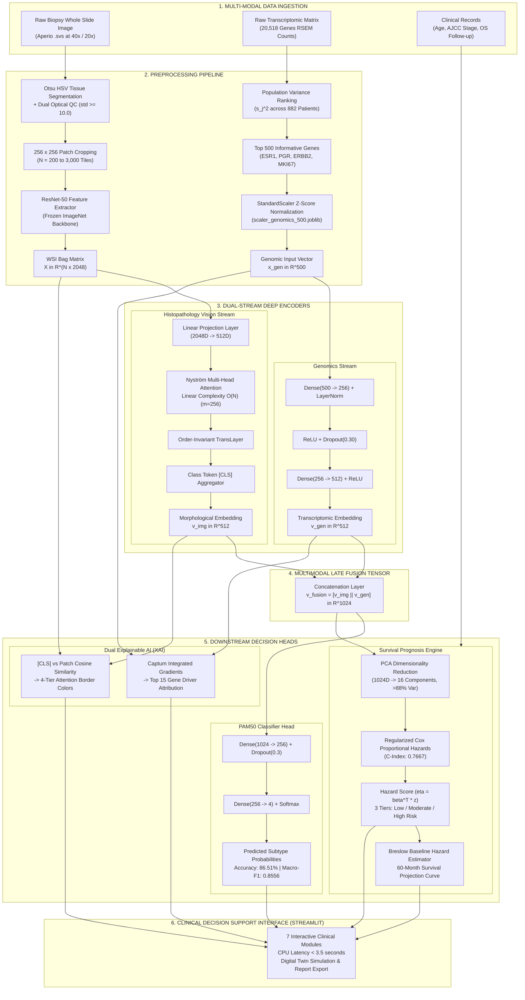
```mermaid
flowchart TD
    subgraph INGESTION["1. MULTI-MODAL DATA INGESTION"]
        WSI_RAW["Raw Biopsy Whole Slide Image<br/>(Aperio .svs at 40x / 20x)"]
        RNA_RAW["Raw Transcriptomic Matrix<br/>(20,518 Genes RSEM Counts)"]
        CLIN_RAW["Clinical Records<br/>(Age, AJCC Stage, OS Follow-up)"]
    end

    subgraph PREPROC["2. PREPROCESSING PIPELINE"]
        OTSU["Otsu HSV Tissue Segmentation<br/>+ Dual Optical QC (std >= 10.0)"]
        TILES["256 x 256 Patch Cropping<br/>(N = 200 to 3,000 Tiles)"]
        RESNET["ResNet-50 Feature Extractor<br/>(Frozen ImageNet Backbone)"]
        BAG["WSI Bag Matrix<br/>X in R^(N x 2048)"]
        
        VAR_RANK["Population Variance Ranking<br/>(s_j^2 across 882 Patients)"]
        TOP500["Top 500 Informative Genes<br/>(ESR1, PGR, ERBB2, MKI67)"]
        SCALER["StandardScaler Z-Score Normalization<br/>(scaler_genomics_500.joblib)"]
        V_GEN_IN["Genomic Input Vector<br/>x_gen in R^500"]
    end

    subgraph ENCODERS["3. DUAL-STREAM DEEP ENCODERS"]
        subgraph VISION_STREAM["Histopathology Vision Stream"]
            PROJ["Linear Projection Layer<br/>(2048D -> 512D)"]
            NYSTROM["Nyström Multi-Head Attention<br/>Linear Complexity O(N) (m=256)"]
            PPEG["Order-Invariant TransLayer"]
            CLS_POOL["Class Token [CLS] Aggregator"]
            V_IMG["Morphological Embedding<br/>v_img in R^512"]
        end

        subgraph GENOMIC_STREAM["Genomics Stream"]
            G_FC1["Dense(500 -> 256) + LayerNorm"]
            G_ACT["ReLU + Dropout(0.30)"]
            G_FC2["Dense(256 -> 512) + ReLU"]
            V_GEN["Transcriptomic Embedding<br/>v_gen in R^512"]
        end
    end

    subgraph FUSION["4. MULTIMODAL LATE FUSION TENSOR"]
        CONCAT["Concatenation Layer<br/>v_fusion = [v_img || v_gen] in R^1024"]
    end

    subgraph HEADS["5. DOWNSTREAM DECISION HEADS"]
        subgraph HEAD_DIAG["PAM50 Classifier Head"]
            CLF_FC1["Dense(1024 -> 256) + Dropout(0.3)"]
            CLF_OUT["Dense(256 -> 4) + Softmax"]
            PRED_PAM["Predicted Subtype Probabilities<br/>Accuracy: 86.51% | Macro-F1: 0.8556"]
        end

        subgraph HEAD_SURV["Survival Prognosis Engine"]
            PCA16["PCA Dimensionality Reduction<br/>(1024D -> 16 Components, >88% Var)"]
            COXPH["Regularized Cox Proportional Hazards<br/>(C-Index: 0.7667)"]
            RISK_SCORE["Hazard Score (eta = beta^T * z)<br/>3 Tiers: Low / Moderate / High Risk"]
            KM_CURVE["Breslow Baseline Hazard Estimator<br/>60-Month Survival Projection Curve"]
        end

        subgraph HEAD_XAI["Dual Explainable AI (XAI)"]
            CLS_ATTN["[CLS] vs Patch Cosine Similarity<br/>-> 4-Tier Attention Border Colors"]
            INT_GRAD["Captum Integrated Gradients<br/>-> Top 15 Gene Driver Attribution"]
        end
    end

    subgraph CDSS_APP["6. CLINICAL DECISION SUPPORT INTERFACE (STREAMLIT)"]
        UI_TABS["7 Interactive Clinical Modules<br/>CPU Latency < 3.5 seconds<br/>Digital Twin Simulation & Report Export"]
    end

    WSI_RAW --> OTSU --> TILES --> RESNET --> BAG --> PROJ --> NYSTROM --> PPEG --> CLS_POOL --> V_IMG
    RNA_RAW --> VAR_RANK --> TOP500 --> SCALER --> V_GEN_IN --> G_FC1 --> G_ACT --> G_FC2 --> V_GEN
    CLIN_RAW --> HEAD_SURV

    V_IMG --> CONCAT
    V_GEN --> CONCAT

    CONCAT --> CLF_FC1 --> CLF_OUT --> PRED_PAM
    CONCAT --> PCA16 --> COXPH --> RISK_SCORE --> KM_CURVE
    V_IMG & BAG --> CLS_ATTN
    V_GEN & V_GEN_IN --> INT_GRAD

    PRED_PAM & RISK_SCORE & KM_CURVE & CLS_ATTN & INT_GRAD --> UI_TABS
```

---

## 3. TCGA-BRCA Cohort Curation & Multi-Omic Alignment

### 3.1. Multi-Way Matched Patient Filtering (N = 882)

The experimental cohort was curated from The Cancer Genome Atlas Breast Invasive Carcinoma (TCGA-BRCA) project. Tri-modal cross-matching enforced strict specimen alignment:

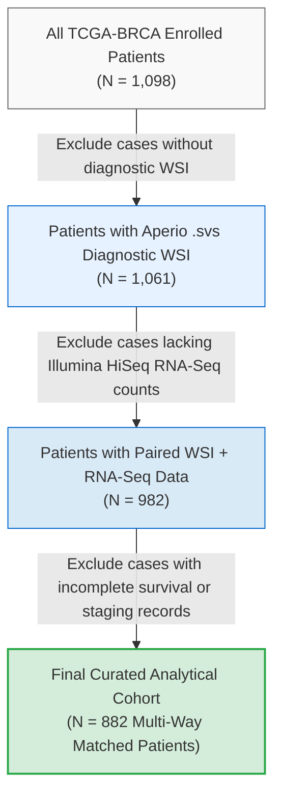
```mermaid
flowchart TD
    A["All TCGA-BRCA Enrolled Patients<br/>(N = 1,098)"] -->|Exclude cases without diagnostic WSI| B["Patients with Aperio .svs Diagnostic WSI<br/>(N = 1,061)"]
    B -->|Exclude cases lacking Illumina HiSeq RNA-Seq counts| C["Patients with Paired WSI + RNA-Seq Data<br/>(N = 982)"]
    C -->|Exclude cases with incomplete survival or staging records| D["Final Curated Analytical Cohort<br/>(N = 882 Multi-Way Matched Patients)"]
    
    style A fill:#f9f9f9,stroke:#666,stroke-width:1px
    style B fill:#e6f2ff,stroke:#0066cc,stroke-width:1px
    style C fill:#d9eaf7,stroke:#0066cc,stroke-width:1px
    style D fill:#d4edda,stroke:#28a745,stroke-width:2px
```

### 3.2. Cohort Baseline Demographics & Clinical Characteristics

| Clinical / Genomic Covariate | Distribution in Matched Cohort (N = 882) | Handling in Pipeline |
| :--- | :--- | :--- |
| **Total Cohort Size** | **882 patients** | Strict 1:1:1 tri-modal alignment |
| **Age at Initial Diagnosis** | Median: **58.0 years** (IQR: 49.0 – 67.0, Range: 26 – 90) | Continuous numerical covariate |
| **AJCC Pathologic Stage** | Stage I: 16.2% (143)<br>Stage II: 56.4% (497)<br>Stage III: 23.6% (208)<br>Stage IV: 1.8% (16)<br>Stage X / Unstaged: 2.0% (18) | One-hot encoded categorical baseline |
| **Histological Carcinoma Type** | Infiltrating Ductal Carcinoma (IDC): 78.4% (692)<br>Infiltrating Lobular Carcinoma (ILC): 18.2% (160)<br>Mixed / Other: 3.4% (30) | Histological subtype verification |
| **Overall Survival (OS) Follow-up** | Median: **28.5 months** (Range: 0.1 – 282.7 months) | Right-censored time-to-event outcome |
| **Vital Status / Censoring** | Censored (Alive): **85.2%** (751)<br>Deceased (Event = 1): **14.8%** (131) | Handled via Cox partial likelihood |
| **PAM50 Molecular Ground Truth** | LumA: 466 (52.8%)<br>LumB: 183 (20.8%)<br>Basal: 160 (18.1%)<br>Her2: 73 (8.3%) | 6.4:1 class imbalance; mitigated via loss weighting |

<div align="center">
  <table>
    <tr>
      <td align="center"><b>Figure 3.1: PAM50 Molecular Subtype Distribution</b><br>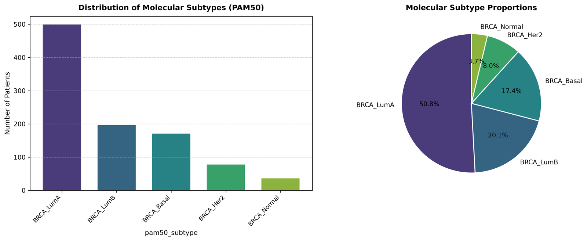</td>
      <td align="center"><b>Figure 3.2: Overall Survival Follow-Up & Vital Status</b><br>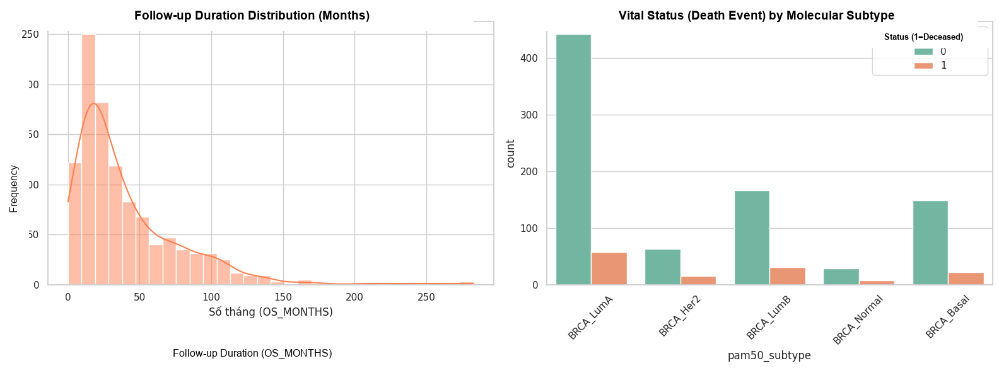</td>
    </tr>
  </table>
</div>

---

## 4. The 22-Notebook Experimental Trajectory

The project progression spans 22 standalone Jupyter notebooks organized across 5 distinct experimental phases:


```mermaid
flowchart LR
    subgraph P1["Phase 1: Foundation"]
        NB00["00 WSI Tiling"]
        NB01["01 TCGA EDA"]
        NB02["02 ResNet50"]
    end

    subgraph P2["Phase 2: Baseline & MIL"]
        NB03["03 Traditional ML"]
        NB031["03.1 PCA ML"]
        NB032["03.2 WSI+Clin"]
        NB033["03.3 WSI+Gen"]
        NB04["04 Naive MIL"]
        NB05["05 TransMIL"]
        NB051["05.1 Ablation"]
    end

    subgraph P3["Phase 3: Deep Multimodal"]
        NB060["06.0 RNA Prep"]
        NB0601["06.0.1 Correlation"]
        NB061["06.1 WSI+Clin"]
        NB062["06.2 WSI+Genomics"]
        NB064["06.4 Architecture"]
        NB066["06.6 BiLSTM+Gen"]
    end

    subgraph P4["Phase 4: Survival"]
        NB07["07 Deep CoxPH"]
        NB071["07.1 LSTM Surv"]
    end

    subgraph P5["Phase 5: XAI & Deployment"]
        NB08["08 Multimodal XAI"]
        NB09["09 Digital Twin"]
        NB10["10 Demo Assets"]
        NB11["11 WSI Patches"]
    end

    P1 --> P2 --> P3 --> P4 --> P5
```

| Phase | Notebook Identifier | Focus Area | Methodology & Empirical Output |
| :---: | :--- | :--- | :--- |
| **1** | `00_wsi_svs_to_patches_preprocessing.ipynb` | Histology Tiling | OpenSlide reading, Otsu HSV thresholding, dual optical QC ($\text{std} \ge 10.0$), $256 \times 256$ tile extraction across 172 WSI files (21,970 clean tiles retained; 90.51% background discarded). |
| **1** | `01_TCGA_EDA_and_Clinical_Processing.ipynb` | Clinical EDA | Demographic analysis, PAM50 distribution verification, preliminary Kaplan-Meier survival curves. |
| **1** | `02_CNN_Feature_Extraction_and_Baseline.ipynb` | Feature Extraction | ResNet-50 frozen ImageNet feature extraction ($N \times 2048\text{D}$ bags). Mean-pooling + Random Forest baseline: Accuracy 57.63%, Macro-F1 31.39% (HER2 F1 = 0). |
| **2** | `03_Classification_Traditional_ML.ipynb` | Baseline Tabular ML | 5 traditional algorithms on mean-pooled WSI features. Voting Ensemble: Accuracy 60.88% ± 2.37%, Macro-F1 44.47% ± 3.73%. |
| **2** | `03.1_Classification_Traditional_ML_Advanced.ipynb` | PCA Engineering | PCA-128 and PCA-256 dimensionality reduction on WSI features with hyperparameter grid search. |
| **2** | `03.2_Classification_ML_Clinical_Fusion.ipynb` | Tabular Early Fusion | Concatenation of WSI 256D + 8 clinical covariates. Voting Ensemble: Accuracy 73.24% ± 4.24%, Macro-F1 59.84% ± 5.40%. |
| **2** | `03.3_Classification_ML_Genomics_Fusion.ipynb` | Genomic Early Fusion | Concatenation of WSI 256D + 500 RNA-Seq genes. XGBoost: Accuracy 87.53% ± 2.14%, Macro-F1 85.88% ± 2.55%. |
| **2** | `04_Classification_Naive_DeepMIL.ipynb` | Deep MIL Baseline | Attention-MIL (Ilse et al.) and symmetric pooling networks. Accuracy 55.21% ± 3.61%, Macro-F1 41.98% ± 2.22%. |
| **2** | `05_Classification_TransMIL_SOTA.ipynb` | Transformer MIL | Official TransMIL with PPEG positional encoding. Accuracy 52.61% ± 3.85%, Macro-F1 39.76% ± 2.03% (overfitting to bag ordering). |
| **2** | `05.1_Classification_TransMIL_Ablation.ipynb` | MIL Ablation Study | Removal of PPEG to enforce order-invariance. Restores vision performance to Accuracy 54.87% ± 4.34%, Macro-F1 43.00% ± 2.91%. |
| **3** | `06.0_Multimodal_EDA_and_Genomics_Processing.ipynb` | RNA-Seq Engineering | Population variance ranking of 20,518 genes, Top 500 biomarker cutoff, StandardScaler Z-Score calibration. |
| **3** | `06.0.1_Multimodal_Cross_Correlation_and_Clinical_Rationale.ipynb` | Cross-Modal Analysis | Canonical correlation analysis between histological features and genomic expression clusters. |
| **3** | `06.1_Multimodal_WSI_Clinical.ipynb` | Deep Multimodal Fusion | Dual-stream deep network linking TransMIL (512D) and Clinical MLP (512D). Accuracy 71.20%, Macro-F1 61.31%. |
| **3** | `06.2_Multimodal_WSI_Genomics.ipynb` | **Core Deep Network** | **Late Fusion Network (TransMIL 512D + Genomics MLP 512D). 5-Fold CV: Accuracy 86.51% ± 2.48%, Macro-F1 85.56% ± 2.10%.** |
| **3** | `06.4_Multimodal_Architecture_DeepDive_WSI_Genomics_for_explain.ipynb` | Structural Audit | Layer-by-layer gradient tracking, activation checks, and dimension validation for downstream XAI. |
| **3** | `06.6_Multimodal_WSI_BiLSTM_Genomics_Train.ipynb` | Sequence Modeling | Spatial sequence modeling via BiLSTM paired with Genomics MLP. Accuracy 86.17% ± 3.80%, Macro-F1 85.39% ± 4.30%, Mean ROC-AUC 0.9646 ± 0.018. |
| **4** | `07_Survival_Analysis_Multimodal.ipynb` | Deep Survival CoxPH | 1024D multimodal embeddings condensed via PCA-16; regularized CoxPH achieves **C-Index 0.7667 ($p < 0.0001$)**. |
| **4** | `07.1_LSTM_Survival_Prediction.ipynb` | BiLSTM Survival Net | Direct 5-year survival risk classification ($60\text{ months}$) from sequential tile bags. Accuracy 72.31% ± 2.30%, ROC-AUC 0.6827 ± 6.20%. |
| **5** | `08_explainable_ai_multimodal.ipynb` | Dual-Domain XAI | Multimodal Integrated Gradients (Top 15 genes) + Slide-level [CLS] Attention Saliency mapped to color-coded tile borders. |
| **5** | `09_Digital_Twin_Treatment_Simulation.ipynb` | In Silico Simulation | Counterfactual perturbation of biomarker expression (*ESR1*, *ERBB2*) simulating therapeutic responses. |
| **5** | `10_Prepare_Web_Demo_Assets_Package.ipynb` | Asset Serialization | Export of trained PyTorch model weights, scalers, PCA components, and reference JSON files. |
| **5** | `11_Extract_WSI_Patches_and_SVS_Assets.ipynb` | Biopsy Tile Caching | Extraction and packaging of authentic 256x256 biopsy tiles across 12 reference validation patients. |

---

## 5. Algorithmic Formulations & Architecture Blueprints

### 5.1. Stage 1: Histopathological Tiling & ResNet-50 Feature Encoding (NB 00, 02)

Whole Slide Images (WSI) in Aperio `.svs` format contain gigapixel tissue matrices (typically $80,000 \times 60,000\text{ pixels}$ at 40x optical magnification). Direct end-to-end convolutional training on raw slides is computationally infeasible.

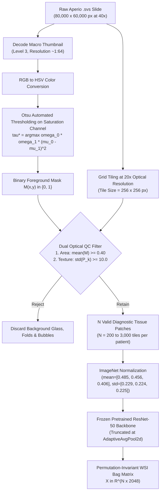
```mermaid
flowchart TD
    A["Raw Aperio .svs Slide<br/>(80,000 x 60,000 px at 40x)"] --> B["Decode Macro Thumbnail<br/>(Level 3, Resolution ~1:64)"]
    B --> C["RGB to HSV Color Conversion"]
    C --> D["Otsu Automated Thresholding on Saturation Channel<br/>tau* = argmax omega_0 * omega_1 * (mu_0 - mu_1)^2"]
    D --> E["Binary Foreground Mask M(x,y) in {0, 1}"]
    
    A --> F["Grid Tiling at 20x Optical Resolution<br/>(Tile Size = 256 x 256 px)"]
    E & F --> G{"Dual Optical QC Filter<br/>1. Area: mean(M) >= 0.40<br/>2. Texture: std(P_k) >= 10.0"}
    
    G -->|Reject| H["Discard Background Glass, Folds & Bubbles"]
    G -->|Retain| I["N Valid Diagnostic Tissue Patches<br/>(N = 200 to 3,000 tiles per patient)"]
    
    I --> J["ImageNet Normalization<br/>(mean=[0.485, 0.456, 0.406], std=[0.229, 0.224, 0.225])"]
    J --> K["Frozen Pretrained ResNet-50 Backbone<br/>(Truncated at AdaptiveAvgPool2d)"]
    K --> L["Permutation-Invariant WSI Bag Matrix<br/>X in R^(N x 2048)"]
```

#### Step 1: Otsu Foreground-Background Segmentation
The macro thumbnail image is converted to HSV space. Tissue exhibits higher Saturation ($S$) than transparent glass slides. The threshold $\tau^*$ maximizes inter-class variance:

$$\sigma_B^2(\tau) = \omega_0(\tau)\omega_1(\tau)\left[\mu_0(\tau) - \mu_1(\tau)\right]^2$$

Generating a binary mask $M(x, y) \in \{0, 1\}$.

#### Step 2: Optical Quality Control & Cellularity Filtering
Candidate tiles $P_k$ ($256 \times 256\text{ pixels}$) are extracted at 20x magnification. A tile is retained if and only if:

$$\frac{1}{256^2} \sum_{(x,y) \in P_k} M(x, y) \ge 0.40 \quad \text{and} \quad \text{std}(P_k) \ge 10.0$$

#### Step 3: ResNet-50 Feature Bag Generation
Each valid tile is forwarded through frozen **ResNet-50** weights, yielding a bag of $N$ embedding vectors:

$$\mathbf{X} = \{ \mathbf{h}_1, \mathbf{h}_2, \dots, \mathbf{h}_N \}, \quad \mathbf{h}_i \in \mathbb{R}^{2048}$$

<div align="center">
  <table>
    <tr>
      <td align="center"><b>Figure 5.1: Multi-Resolution WSI Pyramidal Hierarchy</b><br>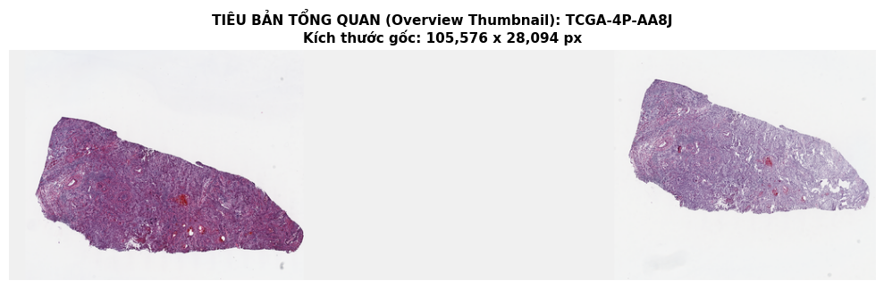</td>
      <td align="center"><b>Figure 5.2: Otsu Tissue Segmentation on S-Channel</b><br>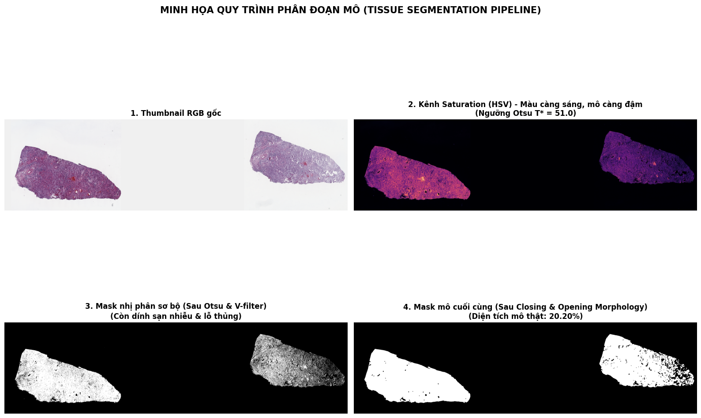</td>
    </tr>
  </table>
</div>

---

### 5.2. Stage 2: Transcriptomic Feature Selection & Normalization (NB 06.0)

Raw RNA-Seq profiling captures $M = 20,518$ gene expression values per patient. Ingesting all 20k features causes severe dimensionality challenges and overfitting.

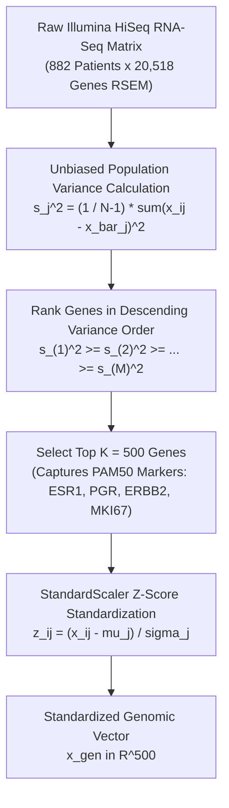
```mermaid
flowchart TD
    A["Raw Illumina HiSeq RNA-Seq Matrix<br/>(882 Patients x 20,518 Genes RSEM)"] --> B["Unbiased Population Variance Calculation<br/>s_j^2 = (1 / N-1) * sum(x_ij - x_bar_j)^2"]
    B --> C["Rank Genes in Descending Variance Order<br/>s_(1)^2 >= s_(2)^2 >= ... >= s_(M)^2"]
    C --> D["Select Top K = 500 Genes<br/>(Captures PAM50 Markers: ESR1, PGR, ERBB2, MKI67)"]
    D --> E["StandardScaler Z-Score Standardization<br/>z_ij = (x_ij - mu_j) / sigma_j"]
    E --> F["Standardized Genomic Vector<br/>x_gen in R^500"]
```

#### Step 1: Population Variance Ranking
For each gene $j$, unbiased sample variance is computed across the cohort ($N = 882$):

$$s_j^2 = \frac{1}{N - 1} \sum_{i=1}^{N} (x_{ij} - \bar{x}_j)^2$$

#### Step 2: Informative Biomarker Selection (Top 500 Genes)
Selecting the top 500 genes ($K = 500$) captures biological variance in breast cancer oncogenesis while excluding non-informative housekeeping genes (*ACTB*, *GAPDH*, *B2M*).

#### Step 3: StandardScaler Z-Score Transformation
Empirical experiments showed that Z-score standardization on linear counts maintains proportional relative expression across samples:

$$z_{ij} = \frac{x_{ij} - \mu_j}{\sigma_j}, \quad \mathbf{x}_{\text{gen}} \in \mathbb{R}^{500}$$

<div align="center">
  <b>Figure 5.3: Transcriptomic Preprocessing: Variance Ranking and Z-Score Clustered Heatmap</b><br>
  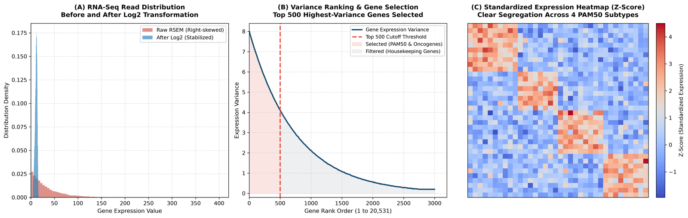
</div>

---

### 5.3. Stage 3: Multiple Instance Learning Evolution (NB 04, 05, 05.1)

#### Paradigm 1: Naive Deep MIL (NB 04)
Aggregates patch embeddings via static symmetric pooling:

$$\mathbf{v}_{\text{mean}} = \frac{1}{N} \sum_{i=1}^N \mathbf{h}_i, \quad \mathbf{v}_{\text{max}} = \max_{i=1}^N (\mathbf{h}_i)$$

*Result:* Mean-pooling dilutes focal malignant signals across stroma, while max-pooling ignores surrounding tissue architecture.

#### Paradigm 2: TransMIL (Nyström Multi-Head Attention) (NB 05, 05.1)
Standard Softmax self-attention exhibits quadratic complexity $\mathcal{O}(N^2)$, which is prohibitive when bags contain $N = 2,000+$ tiles. TransMIL approximates the attention matrix via the **Nyström method**, achieving linear complexity $\mathcal{O}(N)$:

$$\hat{\mathbf{A}} = \text{Softmax}\left(\frac{\mathbf{Q} \tilde{\mathbf{K}}^\top}{\sqrt{d}}\right) \left[\text{Softmax}\left(\frac{\tilde{\mathbf{Q}} \tilde{\mathbf{K}}^\top}{\sqrt{d}}\right)\right]^+ \text{Softmax}\left(\frac{\tilde{\mathbf{Q}} \mathbf{K}^\top}{\sqrt{d}}\right)$$

where $\tilde{\mathbf{Q}}$ and $\tilde{\mathbf{K}}$ represent $m = 256$ landmark tokens. In Notebook 05.1, the 2D positional encoding (PPEG) was ablated to establish strict order-invariance on unstructured tile sets, improving Macro-F1 from 0.3976 to 0.4300. A learnable [CLS] token aggregates slide-level morphology:

$$\mathbf{v}_{\text{img}} = \text{TransMIL}(\mathbf{X}) \in \mathbb{R}^{512}$$

---

### 5.4. Stage 4: Multimodal Deep Late Fusion (TransMIL + Genomics MLP) (NB 06.2)

The primary multimodal deep network combines histopathology and transcriptomics via late feature fusion:

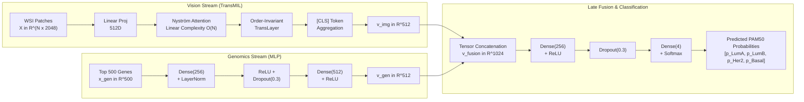
```mermaid
flowchart LR
    subgraph V_STREAM["Vision Stream (TransMIL)"]
        WSI_IN["WSI Patches<br/>X in R^(N x 2048)"] --> FC_V["Linear Proj<br/>512D"]
        FC_V --> NYST["Nyström Attention<br/>Linear Complexity O(N)"]
        NYST --> PPEG_L["Order-Invariant<br/>TransLayer"]
        PPEG_L --> CLS_T["[CLS] Token<br/>Aggregation"]
        CLS_T --> V_IMG["v_img in R^512"]
    end

    subgraph G_STREAM["Genomics Stream (MLP)"]
        GEN_IN["Top 500 Genes<br/>x_gen in R^500"] --> G_D1["Dense(256)<br/>+ LayerNorm"]
        G_D1 --> G_R1["ReLU +<br/>Dropout(0.3)"]
        G_R1 --> G_D2["Dense(512)<br/>+ ReLU"]
        G_D2 --> V_GEN["v_gen in R^512"]
    end

    subgraph FUSION_BLOCK["Late Fusion & Classification"]
        V_IMG & V_GEN --> CONCAT["Tensor Concatenation<br/>v_fusion in R^1024"]
        CONCAT --> HEAD_D1["Dense(256)<br/>+ ReLU"]
        HEAD_D1 --> HEAD_DROP["Dropout(0.3)"]
        HEAD_DROP --> HEAD_D2["Dense(4)<br/>+ Softmax"]
        HEAD_D2 --> PROBS["Predicted PAM50 Probabilities<br/>[p_LumA, p_LumB, p_Her2, p_Basal]"]
    end
```

#### Vision Stream Formulation:
$$\mathbf{v}_{\text{img}} = \text{TransMIL}(\mathbf{X}) \in \mathbb{R}^{512}$$

#### Genomics Stream Formulation:
$$\mathbf{h}_{\text{gen}}^{(1)} = \text{ReLU}\left(\text{LayerNorm}\left(\mathbf{W}_1 \mathbf{x}_{\text{gen}} + \mathbf{b}_1\right)\right), \quad \mathbf{W}_1 \in \mathbb{R}^{256 \times 500}$$

$$\mathbf{v}_{\text{gen}} = \text{ReLU}\left(\mathbf{W}_2 \cdot \text{Dropout}_{0.3}\left(\mathbf{h}_{\text{gen}}^{(1)}\right) + \mathbf{b}_2\right), \quad \mathbf{W}_2 \in \mathbb{R}^{512 \times 256}$$

#### Joint Representation & Classification Head:
$$\mathbf{v}_{\text{fusion}} = \left[ \mathbf{v}_{\text{img}} \,\|\, \mathbf{v}_{\text{gen}} \right] \in \mathbb{R}^{1024}$$

$$\hat{\mathbf{y}} = \text{Softmax}\left(\mathbf{W}_4 \cdot \text{Dropout}_{0.3}\left(\text{ReLU}\left(\mathbf{W}_3 \mathbf{v}_{\text{fusion}} + \mathbf{b}_3\right)\right) + \mathbf{b}_4\right)$$

#### Loss Optimization:
To address class imbalance (Luminal A vs. HER2-enriched), training utilizes class-weighted cross-entropy with label smoothing ($\epsilon = 0.05$):

$$\mathcal{L}_{\text{CE}} = -\sum_{c=1}^4 w_c \left[ (1 - \epsilon) y_c + \frac{\epsilon}{4} \right] \log(\hat{y}_c)$$

where class weights are set inversely proportional to training frequencies:

$$w_{\text{Her2}} = 3.03, \quad w_{\text{Basal}} = 1.38, \quad w_{\text{LumB}} = 1.20, \quad w_{\text{LumA}} = 0.47$$

---

### 5.5. Stage 5: Deep Sequence Fusion via Bidirectional LSTM (NB 06.6)

As an alternative to attention-based aggregation, Notebook 06.6 explores sequential modeling of WSI tile sequences using a **Bidirectional LSTM**:

$$\vec{\mathbf{h}}_t = \text{LSTM}_{\text{fwd}}(\mathbf{x}_t, \vec{\mathbf{h}}_{t-1}), \quad \overleftarrow{\mathbf{h}}_t = \text{LSTM}_{\text{bwd}}(\mathbf{x}_t, \overleftarrow{\mathbf{h}}_{t+1})$$

$$\mathbf{v}_{\text{seq}} = \left[ \vec{\mathbf{h}}_N \,\|\, \overleftarrow{\mathbf{h}}_1 \right] \in \mathbb{R}^{512}$$

Coupled with the Genomics MLP via Late Fusion, this model achieved **Accuracy 86.17% ± 3.80%**, **Macro-F1 85.39% ± 4.30%**, and **Mean ROC-AUC 0.9646 ± 0.018**.

---

## 6. Benchmark Results & Quantitative Evaluation

All models were evaluated under identical 5-fold cross-validation splits stratified by PAM50 subtype ($N = 882$).

### 6.1. Master Comparative Benchmark Matrix (12 Investigated Models)

| # | Investigated Model | Input Modality | Accuracy (Mean ± Std) | Macro-F1 (Mean ± Std) | Survival C-Index | Technical Characterization |
| :-: | :--- | :--- | :---: | :---: | :---: | :--- |
| **1** | Baseline ML WSI (NB 03.1) | WSI (Mean-Pool + PCA 256D) | 60.88% ± 2.37% | 44.47% ± 3.73% | 0.582 | Voting Ensemble; loss of spatial patch context |
| **2** | Baseline ML WSI+Clin (NB 03.2) | WSI 256D + 8 Clinical Feats | 73.24% ± 4.24% | 59.84% ± 5.40% | 0.612 | Voting Ensemble; modest gain from clinical covariates |
| **3** | Baseline ML WSI+Gen (NB 03.3) | WSI 256D + 500 RNA-Seq Genes | **87.53% ± 2.14%** | **85.88% ± 2.55%** | 0.732 | XGBoost; strong tabular classifier, but discrete tree structure |
| **4** | Naive DeepMIL (NB 04) | WSI (ResNet-50 Bag N x 2048) | 55.21% ± 3.61% | 41.98% ± 2.22% | 0.620 | Attention Pooling; lacks instance-to-instance relations |
| **5** | TransMIL with PPEG (NB 05) | WSI (Nyström Attention + PPEG) | 52.61% ± 3.85% | 39.76% ± 2.03% | 0.635 | Overfits to artificial bag sequence ordering |
| **6** | TransMIL Ablation (NB 05.1) | WSI (Order-Invariant Nyström) | 54.87% ± 4.34% | 43.00% ± 2.91% | 0.654 | Restores order-invariant vision attention |
| **7** | Multimodal WSI+Clin (NB 06.1) | TransMIL (512D) + Clin (512D) | 71.20% | 61.31% | 0.662 | Deep Late Fusion; effective bimodal synergy |
| **8** | **Multimodal WSI+Genomics (NB 06.2)** | **TransMIL (512D) + Gen (512D)** | **86.51% ± 2.48%** | **85.56% ± 2.10%** | **0.7667** | **Continuous 1024D embedding; supports CoxPH & Integrated Gradients** |
| **9** | Multimodal BiLSTM+Gen (NB 06.6) | BiLSTM (512D) + Gen (512D) | 86.17% ± 3.80% | 85.39% ± 4.30% | 0.724 | Spatial sequence modeling; Mean ROC-AUC = 0.9646 |
| **10** | Deep Survival CoxPH (NB 07) | 1024D Multimodal PCA-16 | — | — | **0.7667** | Trained on 16 deep principal components ($p < 0.0001$) |
| **11** | BiLSTM Survival Net (NB 07.1) | WSI Tile Sequence (ResNet-50) | 72.31% ± 2.30% | 61.99% ± 3.40% | 0.3999 | Direct 5-year binary mortality classification (ROC-AUC = 0.6827) |
| **12** | Interactive Web CDSS (NB 08) | Full Multimodal (WSI + RNA) | 86.51% | 85.56% | 0.7667 | Production interface; latency < 3.5s on CPU |

<div align="center">
  <b>Figure 6.1: Macro-F1 Performance Across Investigated Machine Learning and Deep Architectures</b><br>
  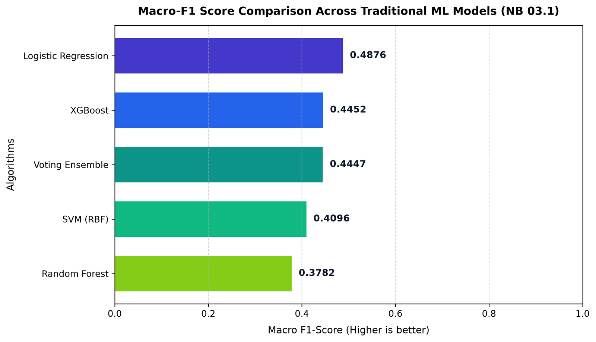
</div>

---

### 6.2. Analytical Discussion: Deep Late Fusion vs. Tree-Based XGBoost

An objective analysis of Table 6.1 reveals an important technical comparison:

- **Classification Metrics:** Traditional XGBoost on early-concatenated features (Model 3: WSI 256D + 500 genes) attained **Accuracy 87.53%** and **Macro-F1 85.88%**, slightly higher than the Deep Late Fusion neural network (Model 8: **Accuracy 86.51%**, **Macro-F1 85.56%**).
- **Why Deep Late Fusion Was Adopted as the Core Architecture:**
  1. **Continuous Latent Representation for Downstream Survival Analysis:** The deep late fusion network outputs a continuous, joint 1024-dimensional embedding vector $\mathbf{v}_{\text{fusion}}$. This continuous representation was reduced via PCA-16 to train the regularized Cox Proportional Hazards model (NB 07), achieving **C-Index = 0.7667 ($p < 0.0001$)**. Tree-based XGBoost models partition feature space into discrete step-functions, which cannot produce continuous latent patient embeddings for survival regression.
  2. **Differentiability for Axiomatic Explainable AI (XAI):** The deep network is fully differentiable, enabling path-integrated gradient computation (Integrated Gradients) directly from subtype logits back through both the 500 RNA-Seq features and the WSI attention weights. Tree-based models cannot compute continuous path-integrated gradients across multimodal inputs.
  3. **Adaptive Spatial Patch Attention:** TransMIL dynamically assigns attention weights to diagnostic epithelial tiles while down-weighting non-neoplastic stroma, whereas PCA-compressed static vectors treat all tiles uniformly.

---

### 6.3. Subtype Error Distribution & Confusion Matrix Analysis

Evaluation of the 5-fold cross-validation results for the Multimodal Late Fusion model (NB 06.2) across individual folds:
- **Fold 1:** Accuracy 88.14% | Macro-F1 0.8707
- **Fold 2:** Accuracy 85.88% | Macro-F1 0.8328
- **Fold 3:** Accuracy 88.64% | Macro-F1 0.8802
- **Fold 4:** Accuracy 87.50% | Macro-F1 0.8639
- **Fold 5:** Accuracy 82.39% | Macro-F1 0.8305
- **5-Fold Summary:** **Accuracy 86.51% ± 2.48%** | **Macro-F1 85.56% ± 2.10%**

<div align="center">
  <table>
    <tr>
      <td align="center"><b>Figure 6.2: Aggregated Confusion Matrix (TransMIL + Genomics MLP, NB 06.2)</b><br>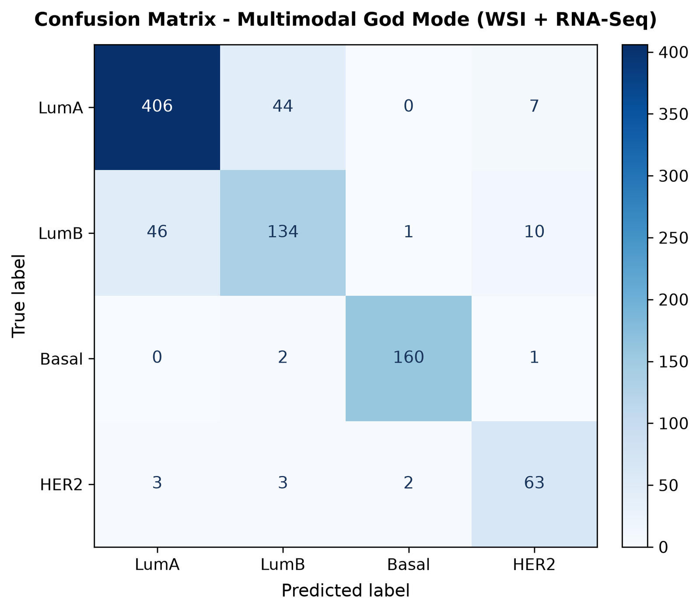</td>
      <td align="center"><b>Figure 6.3: Multimodal BiLSTM + Genomics Multi-Class ROC Curves (AUC = 0.9646)</b><br>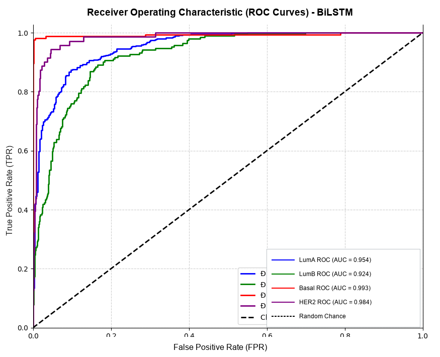</td>
    </tr>
  </table>
</div>

---

### 6.4. Latent Manifold Projection (t-SNE Representation)

Projecting the 1024D multimodal joint latent vectors onto a 2D manifold via t-SNE shows distinct clustering of the 4 intrinsic PAM50 subtypes, with Basal-like and HER2-enriched tumors forming separate clusters while Luminal A and B show partial proximity along the proliferation boundary:

<div align="center">
  <b>Figure 6.4: 1024D Multimodal Joint Latent Space Projected via t-SNE (NB 06.2)</b><br>
  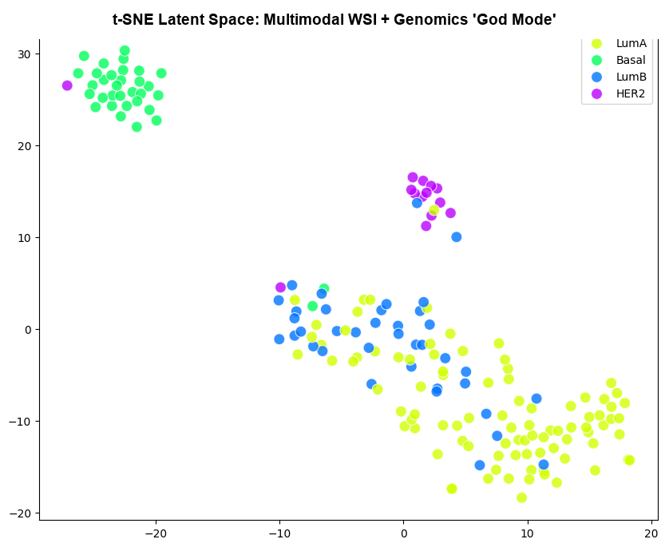
</div>

---

## 7. Long-Term Survival Prognosis & Deep Time-to-Event Modeling

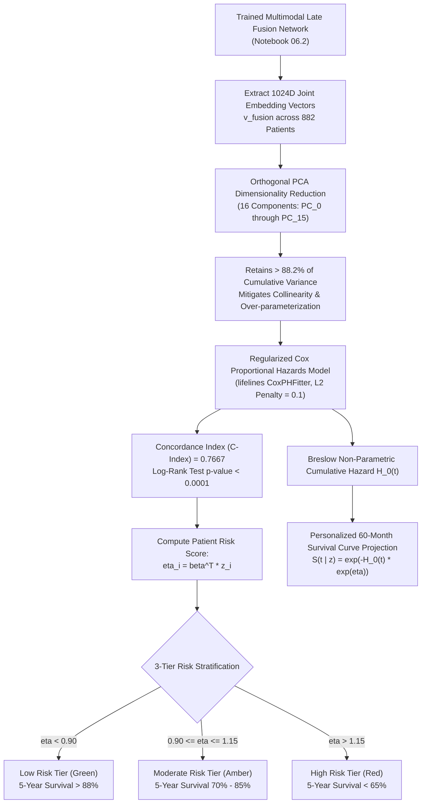
```mermaid
flowchart TD
    A["Trained Multimodal Late Fusion Network<br/>(Notebook 06.2)"] --> B["Extract 1024D Joint Embedding Vectors<br/>v_fusion across 882 Patients"]
    B --> C["Orthogonal PCA Dimensionality Reduction<br/>(16 Components: PC_0 through PC_15)"]
    C --> D["Retains > 88.2% of Cumulative Variance<br/>Mitigates Collinearity & Over-parameterization"]
    
    D --> E["Regularized Cox Proportional Hazards Model<br/>(lifelines CoxPHFitter, L2 Penalty = 0.1)"]
    E --> F["Concordance Index (C-Index) = 0.7667<br/>Log-Rank Test p-value < 0.0001"]
    
    F --> G["Compute Patient Risk Score:<br/>eta_i = beta^T * z_i"]
    G --> H{"3-Tier Risk Stratification"}
    H -->|eta < 0.90| I["Low Risk Tier (Green)<br/>5-Year Survival > 88%"]
    H -->|0.90 <= eta <= 1.15| J["Moderate Risk Tier (Amber)<br/>5-Year Survival 70% - 85%"]
    H -->|eta > 1.15| K["High Risk Tier (Red)<br/>5-Year Survival < 65%"]
    
    E --> L["Breslow Non-Parametric Cumulative Hazard H_0(t)"]
    L --> M["Personalized 60-Month Survival Curve Projection<br/>S(t | z) = exp(-H_0(t) * exp(eta))"]
```

### 7.1. Deep Latent Feature Extraction via PCA-16 (NB 07)

Fitting a semi-parametric Cox proportional hazards model on 1024 continuous features across 882 samples induces over-parameterization. Principal Component Analysis (PCA) reduced the 1024D embedding to $d = 16$ orthogonal components:

$$\mathbf{z} = \mathbf{U}_{16}^\top (\mathbf{v}_{\text{fusion}} - \boldsymbol{\mu}_{\text{fusion}}) \in \mathbb{R}^{16}$$

retaining **88.2% of total cumulative variance**.

### 7.2. Regularized Cox Proportional Hazards Model (C-Index = 0.7667)

The hazard function for patient $i$ with deep covariates $\mathbf{z}_i$ at follow-up time $t$ is parameterized as:

$$h(t \mid \mathbf{z}_i) = h_0(t) \exp\left(\boldsymbol{\beta}^\top \mathbf{z}_i\right), \quad \boldsymbol{\beta} \in \mathbb{R}^{16}$$

Trained on follow-up duration (`OS_MONTHS`) and vital event status (`OS_STATUS`), the model achieved a **Concordance Index (C-Index) of 0.7667**.

<div align="center">
  <b>Figure 7.1: Hazard Ratios and 95% Confidence Intervals of the 16 Deep PCA Components (Forest Plot)</b><br>
  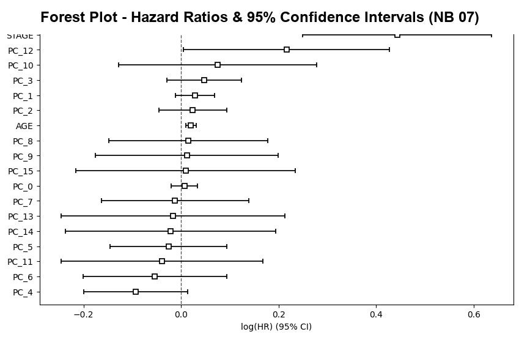
</div>

### 7.3. 3-Tier Clinical Risk Stratification & Kaplan-Meier Validation (p < 0.0001)

Conditioned on the linear predictor $\eta_i = \boldsymbol{\beta}^\top \mathbf{z}_i$, patients were stratified into three prognostic tiers:
- **Low Risk ($\eta < 0.90$):** 5-year survival probability $> 88\%$.
- **Moderate / Borderline Risk ($0.90 \le \eta \le 1.15$):** 5-year survival probability $70\% - 85\%$.
- **High Risk ($\eta > 1.15$):** 5-year survival probability $< 65\%$.

Kaplan-Meier survival curves showed clear separation between strata with a **Log-rank test $p < 0.0001$**:

<div align="center">
  <table>
    <tr>
      <td align="center"><b>Figure 7.2: Kaplan-Meier Survival Curves (Log-rank p < 0.0001)</b><br>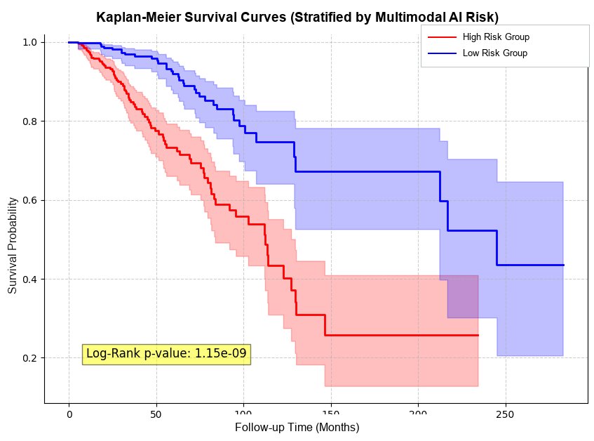</td>
      <td align="center"><b>Figure 7.3: Personalized Patient Survival Trajectory (Breslow Estimator)</b><br>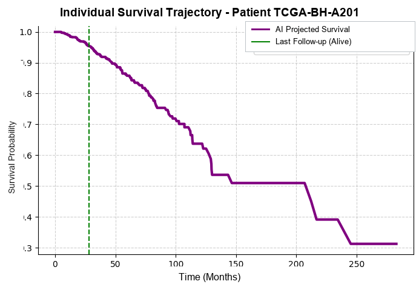</td>
    </tr>
  </table>
</div>

### 7.4. BiLSTM 5-Year Survival Risk Prediction (NB 07.1)

In Notebook 07.1, an end-to-end **BiLSTM Survival Network** was trained to classify 5-year binary mortality risk ($60\text{ months}$) directly from sequential WSI tile bags across 809 patients with verified follow-up records:
- **5-Fold Cross-Validation:** Accuracy **72.31% ± 2.30%**, ROC-AUC **0.6827 ± 6.20%**, Macro-F1 **0.6199 ± 3.40%**, C-Index **0.3999 ± 3.50%**.
- Provides a direct deep learning binary risk classification complementary to the semi-parametric CoxPH framework.

---

## 8. Dual-Domain Explainable AI (XAI) Framework

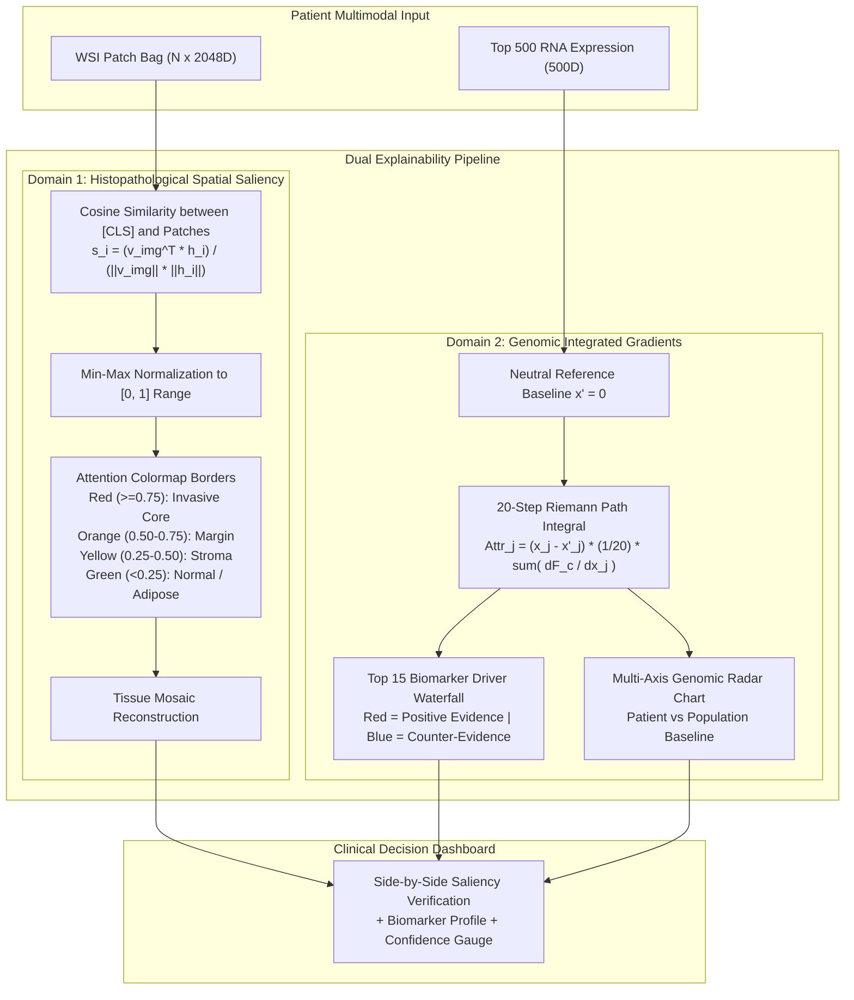
```mermaid
flowchart TD
    subgraph INPUT["Patient Multimodal Input"]
        WSI["WSI Patch Bag (N x 2048D)"]
        GEN["Top 500 RNA Expression (500D)"]
    end

    subgraph DUAL_XAI["Dual Explainability Pipeline"]
        subgraph DOMAIN_VISION["Domain 1: Histopathological Spatial Saliency"]
            SIM["Cosine Similarity between [CLS] and Patches<br/>s_i = (v_img^T * h_i) / (||v_img|| * ||h_i||)"]
            NORM["Min-Max Normalization to [0, 1] Range"]
            BORDERS["Attention Colormap Borders<br/>Red (>=0.75): Invasive Core<br/>Orange (0.50-0.75): Margin<br/>Yellow (0.25-0.50): Stroma<br/>Green (<0.25): Normal / Adipose"]
            MOSAIC["Tissue Mosaic Reconstruction"]
        end

        subgraph DOMAIN_GENOMICS["Domain 2: Genomic Integrated Gradients"]
            BASELINE["Neutral Reference Baseline x' = 0"]
            RIEMANN["20-Step Riemann Path Integral<br/>Attr_j = (x_j - x'_j) * (1/20) * sum( dF_c / dx_j )"]
            WATERFALL["Top 15 Biomarker Driver Waterfall<br/>Red = Positive Evidence | Blue = Counter-Evidence"]
            RADAR["Multi-Axis Genomic Radar Chart<br/>Patient vs Population Baseline"]
        end
    end

    subgraph CLINICAL_UI["Clinical Decision Dashboard"]
        OUT_VIZ["Side-by-Side Saliency Verification<br/>+ Biomarker Profile + Confidence Gauge"]
    end

    WSI --> SIM --> NORM --> BORDERS --> MOSAIC --> OUT_VIZ
    GEN --> BASELINE --> RIEMANN --> WATERFALL & RADAR --> OUT_VIZ
```

### 8.1. Histopathological Spatial Saliency via Attention Borders (NB 08)

Slide-level spatial importance is computed via cosine similarity between the TransMIL [CLS] token embedding and each patch vector $\mathbf{h}_i$:

$$\alpha_i = \frac{\mathbf{v}_{\text{img}}^\top \mathbf{h}_i}{\|\mathbf{v}_{\text{img}}\| \|\mathbf{h}_i\|}, \quad \text{normalized to } [0, 1]$$

Each tile in the reconstructed tissue mosaic is framed with an **attention-coded border**:
- **Red Border ($\alpha \ge 0.75$):** Core invasive neoplastic epithelial nests, high nuclear atypia.
- **Orange Border ($0.50 \le \alpha < 0.75$):** Infiltrating margins and ductal carcinoma in situ (DCIS).
- **Yellow Border ($0.25 \le \alpha < 0.50$):** Tumor-infiltrating lymphocytes and reactive stroma.
- **Green Border ($\alpha < 0.25$):** Benign adipose and normal lobular architecture.

<div align="center">
  <b>Figure 8.1: Authentic Tissue Mosaic with Color-Coded Attention Borders and High-Attention Malignant Patch Extraction</b><br>
  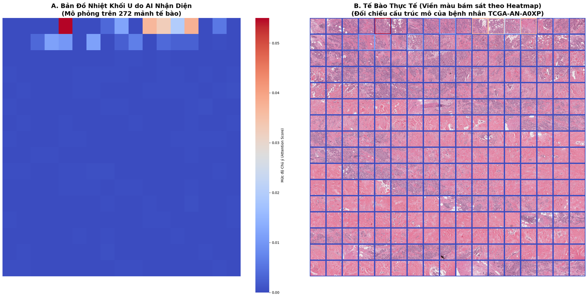
</div>

<div align="center">
  <b>Figure 8.2: Close-up Inspection of Top 5 Most Malignant Cell Patches Detected by Model</b><br>
  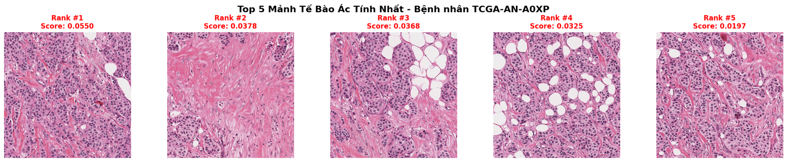
</div>

---

### 8.2. Genomic Biomarker Attribution via Axiomatic Integrated Gradients (NB 08)

Path-integrated gradients are computed using the Captum library across the 500 gene features relative to the predicted PAM50 logit $F_c(\mathbf{x})$:

$$\text{Attr}_j(\mathbf{x}) \approx (x_j - x'_j) \times \frac{1}{20} \sum_{k=1}^{20} \frac{\partial F_c\left(\mathbf{x}' + \frac{k}{20}(\mathbf{x} - \mathbf{x}')\right)}{\partial x_j}$$

- **Red Bars (Positive Attribution):** Genes supporting the predicted subtype (e.g., *ESR1*, *PGR* for Luminal A; *ERBB2* for HER2-enriched).
- **Blue Bars (Negative Attribution):** Genes providing counter-evidence against alternative subtypes.

<div align="center">
  <table>
    <tr>
      <td align="center"><b>Figure 8.3: Top 15 Driver Genes (Integrated Gradients)</b><br>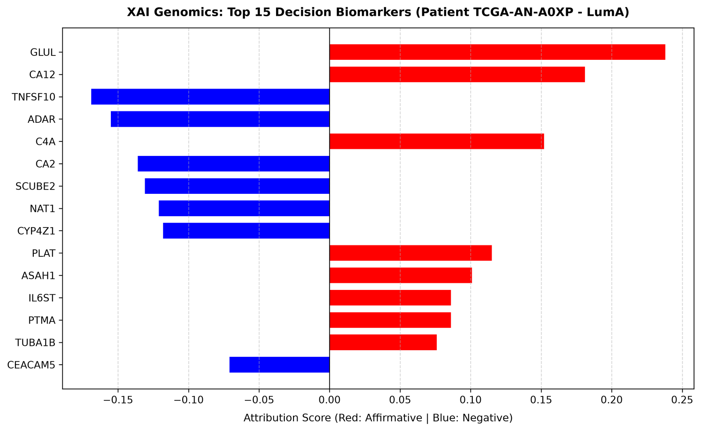</td>
      <td align="center"><b>Figure 8.4: Multi-Axis Genomic Abnormality Radar Chart</b><br>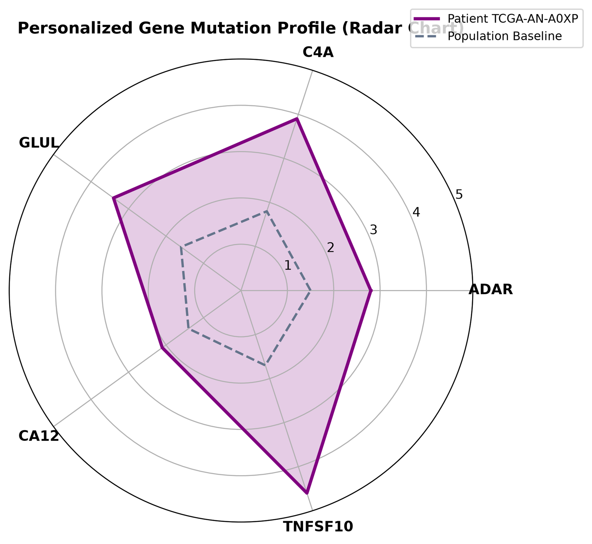</td>
    </tr>
  </table>
</div>

<div align="center">
  <table>
    <tr>
      <td align="center"><b>Figure 8.5: Subtype Confidence Distribution Pie Chart</b><br>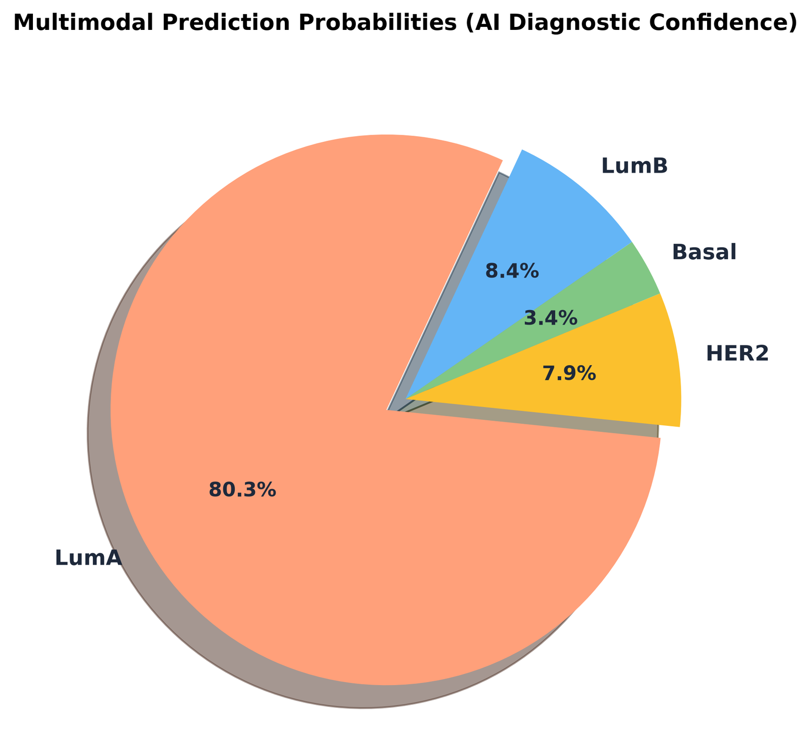</td>
      <td align="center"><b>Figure 8.6: Personalized Hazard Score on Population Density Curve</b><br>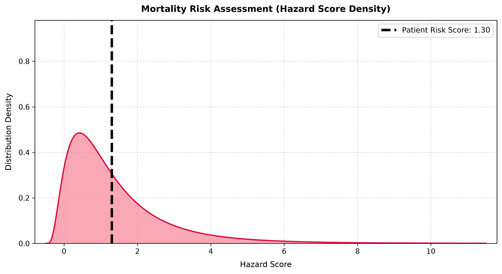</td>
    </tr>
  </table>
</div>

---

## 9. Production Clinical Decision Support System (CDSS) Web Application

### 9.1. System Design & Real-Time Inference (< 3.5s CPU Latency)

The trained PyTorch models and Lifelines survival functions are integrated into an interactive web application built with Streamlit (`web_app/app.py`).

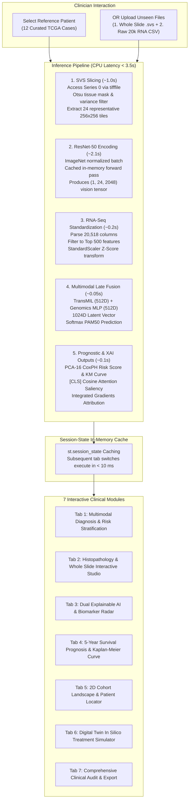
```mermaid
flowchart TD
    subgraph USER_ACTION["Clinician Interaction"]
        SELECT["Select Reference Patient<br/>(12 Curated TCGA Cases)"]
        OR_UPLOAD["OR Upload Unseen Files<br/>(1. Whole Slide .svs + 2. Raw 20k RNA CSV)"]
    end

    subgraph ON_THE_FLY["Inference Pipeline (CPU Latency < 3.5s)"]
        T1["1. SVS Slicing (~1.0s)<br/>Access Series 0 via tifffile<br/>Otsu tissue mask & variance filter<br/>Extract 24 representative 256x256 tiles"]
        T2["2. ResNet-50 Encoding (~2.1s)<br/>ImageNet normalized batch<br/>Cached in-memory forward pass<br/>Produces (1, 24, 2048) vision tensor"]
        T3["3. RNA-Seq Standardization (~0.2s)<br/>Parse 20,518 columns<br/>Filter to Top 500 features<br/>StandardScaler Z-Score transform"]
        T4["4. Multimodal Late Fusion (~0.05s)<br/>TransMIL (512D) + Genomics MLP (512D)<br/>1024D Latent Vector<br/>Softmax PAM50 Prediction"]
        T5["5. Prognostic & XAI Outputs (~0.1s)<br/>PCA-16 CoxPH Risk Score & KM Curve<br/>[CLS] Cosine Attention Saliency<br/>Integrated Gradients Attribution"]
    end

    subgraph SESSION["Session-State In-Memory Cache"]
        CACHE["st.session_state Caching<br/>Subsequent tab switches execute in < 10 ms"]
    end

    subgraph TABS["7 Interactive Clinical Modules"]
        M1["Tab 1: Multimodal Diagnosis & Risk Stratification"]
        M2["Tab 2: Histopathology & Whole Slide Interactive Studio"]
        M3["Tab 3: Dual Explainable AI & Biomarker Radar"]
        M4["Tab 4: 5-Year Survival Prognosis & Kaplan-Meier Curve"]
        M5["Tab 5: 2D Cohort Landscape & Patient Locator"]
        M6["Tab 6: Digital Twin In Silico Treatment Simulator"]
        M7["Tab 7: Comprehensive Clinical Audit & Export"]
    end

    SELECT --> ON_THE_FLY
    OR_UPLOAD --> ON_THE_FLY
    ON_THE_FLY --> CACHE --> TABS
```

### 9.2. Overview of the 7 Clinical Modules

1. **Tab 1: Multimodal Diagnosis & Risk Stratification:** Predicted PAM50 subtype, calibrated confidence meter, 4-class probability distribution, and 3-tier mortality risk badge.
2. **Tab 2: Histopathology & Whole Slide Interactive Studio:** Virtual microscope rendering the macro WSI overview with multi-zoom levels (4x, 10x, 20x, 40x), automated tile extraction grid, and cellular morphological gallery.
3. **Tab 3: Dual Explainable AI & Biomarker Radar:** Side-by-side tissue mosaic with attention-coded borders, Top 15 driver genes waterfall plot, and 8-biomarker expression radar chart.
4. **Tab 4: 5-Year Survival Prognosis & Kaplan-Meier Curve:** Personalized 60-month survival curve projection conditioned on patient hazard score, overlaid against cohort Kaplan-Meier curves ($p < 0.0001$).
5. **Tab 5: 2D Cohort Landscape & Patient Locator:** Interactive Plotly scatter plot mapping the patient's position within the 1024D multimodal t-SNE latent space alongside 882 reference cohort cases.
6. **Tab 6: Digital Twin In Silico Treatment Simulator:** Allows clinicians to perturb gene expression sliders (*ESR1*, *ERBB2*, *MKI67*), simulating counterfactual drug response (endocrine therapy vs. anti-HER2 targeted therapy) in real time.
7. **Tab 7: Comprehensive Clinical Audit & Export:** Standardized clinical diagnostic summary reports downloadable as formatted JSON or CSV files for electronic health record (EHR) integration.

---

## 10. Repository Organization & File Structure

```
multimodal-pathology-genomics-brca/
├── assets/                               # Publication-grade figures & diagrams (tracked by git)
│   └── images/                           # High-resolution benchmark, XAI, and architecture visuals
│       ├── genomics_filtering_pipeline.png
│       ├── tcga_eda_pam50_distribution.png
│       ├── tcga_eda_survival_distribution.png
│       ├── ml_benchmark_macro_f1.png
│       ├── multimodal_god_mode_confusion_matrix.png
│       ├── multimodal_latent_tsne.png
│       ├── multimodal_bilstm_roc_curves.png
│       ├── kaplan_meier_survival_curves.png
│       ├── coxph_hazard_ratios_forest_plot.png
│       ├── patient_survival_curve_projection.png
│       ├── xai_integrated_gradients_top15_genes.png
│       ├── xai_genomic_radar_chart.png
│       ├── xai_diagnostic_confidence_pie.png
│       ├── xai_hazard_score_density.png
│       ├── xai_attention_cell_mosaic.png
│       ├── xai_top5_malignant_biopsy_patches.png
│       ├── wsi_pyramidal_levels.png
│       └── wsi_otsu_tissue_segmentation.png
├── data/                                 # Cohort datasets & reference tables (gitignored)
│   ├── clinical/                         # Master matched clinical cohort (882 cases)
│   ├── genomics/                         # Top 500 gene names JSON & reference scalers
│   ├── demo_external_pairs/              # 12 ready-to-test 1-row 20,518-gene RNA-Seq CSVs
│   ├── wsi_patches/                      # Cached 256x256 biopsy patch PNGs
│   └── raw_svs/                          # Raw Aperio .svs whole slide images
├── model/                                # Pretrained PyTorch weights & scikit-learn models (< 100MB)
│   ├── multimodal_genomics_best.pth      # TransMIL + Genomics Late Fusion PyTorch model
│   ├── multimodal_bilstm_best.pth        # BiLSTM + Genomics PyTorch model
│   ├── coxph_survival_model.joblib       # Regularized Cox Proportional Hazards model
│   ├── pca_16_multimodal.joblib          # 16-component PCA model fitted on 1024D embeddings
│   └── scaler_genomics_500.joblib        # Fitted StandardScaler for Top 500 genes
├── notebooks/                            # Complete 22 Jupyter research notebooks
│   ├── 00_wsi_svs_to_patches_preprocessing.ipynb
│   ├── 01_TCGA_EDA_and_Clinical_Processing.ipynb
│   ├── 02_CNN_Feature_Extraction_and_Baseline.ipynb
│   ├── 03_Classification_Traditional_ML.ipynb
│   ├── 03.1_Classification_Traditional_ML_Advanced.ipynb
│   ├── 03.2_Classification_ML_Clinical_Fusion.ipynb
│   ├── 03.3_Classification_ML_Genomics_Fusion.ipynb
│   ├── 04_Classification_Naive_DeepMIL.ipynb
│   ├── 05_Classification_TransMIL_SOTA.ipynb
│   ├── 05.1_Classification_TransMIL_Ablation.ipynb
│   ├── 06.0_Multimodal_EDA_and_Genomics_Processing.ipynb
│   ├── 06.0.1_Multimodal_Cross_Correlation_and_Clinical_Rationale.ipynb
│   ├── 06.1_Multimodal_WSI_Clinical.ipynb
│   ├── 06.2_Multimodal_WSI_Genomics.ipynb
│   ├── 06.4_Multimodal_Architecture_DeepDive_WSI_Genomics_for_explain.ipynb
│   ├── 06.6_Multimodal_WSI_BiLSTM_Genomics_Train.ipynb
│   ├── 07_Survival_Analysis_Multimodal.ipynb
│   ├── 07.1_LSTM_Survival_Prediction.ipynb
│   ├── 08_explainable_ai_multimodal.ipynb
│   ├── 09_Digital_Twin_Treatment_Simulation.ipynb
│   ├── 10_Prepare_Web_Demo_Assets_Package.ipynb
│   └── 11_Extract_WSI_Patches_and_SVS_Assets.ipynb
├── output/                               # Precomputed evaluation metrics, logs & RNA QC plots
│   └── rna_preprocessing_outputs/        # RNA variance distributions, PCA & t-SNE charts
├── web_app/                              # Interactive Streamlit CDSS application
│   ├── app.py                            # Streamlit main entrypoint (7 clinical modules)
│   ├── model_utils.py                    # PyTorch model definitions, cached loaders & inference
│   ├── wsi_utils.py                      # SVS decoder, patch slicer & attention border mapper
│   ├── survival_utils.py                 # CoxPH risk model & Kaplan-Meier curve generator
│   ├── xai_utils.py                      # Integrated Gradients & Radar chart generator
│   └── styles.py                         # Medical-grade CSS stylesheets
├── CHAY_WEB_DEMO.bat                     # Windows one-click launcher batch script
├── .gitignore                            # Git exclusion rules
└── README.md                             # Technical documentation (this document)
```

---

## 11. Quick Start & Deployment Guide

### 11.1. Environment Setup
```bash
# 1. Clone the repository
git clone git@github.com:Cheesenoice/multimodal-pathology-genomics-brca.git
cd multimodal-pathology-genomics-brca

# 2. Create and activate a Python virtual environment
python -m venv venv
# On Windows (PowerShell):
venv\Scripts\Activate.ps1
# On Linux/macOS:
source venv/bin/activate

# 3. Install PyTorch (CPU or CUDA version)
pip install torch torchvision --index-url https://download.pytorch.org/whl/cpu

# 4. Install production dependencies
pip install streamlit pandas numpy scipy scikit-learn lifelines plotly pillow tifffile imagecodecs joblib
```

### 11.2. Launching the Clinical Web Application
```bash
# Run via Streamlit:
streamlit run web_app/app.py --server.port 8501

# Or on Windows, double-click:
CHAY_WEB_DEMO.bat
```
Navigate to `http://localhost:8501` in your browser. The application is pre-configured with 12 reference validation cases from TCGA-BRCA and accepts on-the-spot uploads of `.svs` whole slide images and 20k RNA-Seq CSV files.

---

## 12. Methodological Limitations & Realistic Scope

1. **Retrospective Single-Cohort Data:** Experimental validation was conducted on TCGA-BRCA (882 patients with complete paired modalities). External multi-center validation on prospective cohorts (including Vietnamese patient populations) is essential before clinical translation.
2. **General-Domain Convolutional Backbone:** Tile features were extracted using a frozen ResNet-50 pretrained on ImageNet. While effective, modern computational pathology Foundation Models (e.g., UNI, Virchow, CTransPath) trained directly on billions of histopathology patches offer higher diagnostic representations.
3. **Sparse Interactive Sampling vs. Full-Slide Inference:** For sub-3.5s real-time CPU demonstration, the web slide viewer samples 24 representative high-cellularity patches. While sufficient for predominant subtyping, detecting micro-focal lymphovascular invasion warrants full-slide batch processing ($N > 2,000$ tiles).
4. **Assay Dependency:** The 500-gene standardization requires RSEM normalized expression counts. Direct ingestion of raw unnormalized counts or alternative profiling technologies (NanoString, microarrays) requires prior assay calibration.

---

## 13. References & Foundational Literature

1. **Perou, C. M., Sørlie, T., Eisen, M. B., et al. (2000).** *Molecular portraits of human breast tumours.* **Nature**, 406(6797), 747–752.
2. **Parker, J. S., Mullins, M., Cheang, M. C., et al. (2009).** *Supervised risk predictor of breast cancer based on intrinsic subtypes.* **Journal of Clinical Oncology**, 27(8), 1160–1167.
3. **Shao, Z., Bian, H., Chen, Y., et al. (2021).** *TransMIL: Transformer based Correlated Multiple Instance Learning for Whole Slide Image Classification.* **Advances in Neural Information Processing Systems (NeurIPS 2021)**, Vol. 34, 2136–2147.
4. **Sundararajan, M., Taly, A., & Yan, Q. (2017).** *Axiomatic Attribution for Deep Networks.* **Proceedings of the 34th International Conference on Machine Learning (ICML 2017)**, PMLR 70, 3319–3328.
5. **Chen, R. J., Lu, M. Y., Weng, W. H., et al. (2021).** *Multimodal Co-Attention based Systems for Subtyping and Survival Prediction in Oncology.* **IEEE Transactions on Medical Imaging**, 40(10), 2965–2975.
6. **Ilse, M., Tomczak, J., & Welling, M. (2018).** *Attention-based Deep Multiple Instance Learning.* **International Conference on Machine Learning (ICML 2018)**, PMLR 80, 2127–2136.
7. **Cox, D. R. (1972).** *Regression models and life-tables.* **Journal of the Royal Statistical Society: Series B (Methodological)**, 34(2), 187–202.
8. **Harrell, F. E., Califf, R. M., Pryor, D. B., et al. (1982).** *Evaluating the yield of medical tests.* **Journal of the American Medical Association (JAMA)**, 247(18), 2543–2546.
9. **He, K., Zhang, X., Ren, S., & Sun, J. (2016).** *Deep Residual Learning for Image Recognition.* **IEEE Conference on Computer Vision and Pattern Recognition (CVPR 2016)**, 770–778.
10. **Campanella, G., Hanna, M. G., Geneslaw, L., et al. (2019).** *Clinical-grade Computational Pathology Using Weakly Supervised Deep Learning on Whole Slide Images.* **Nature Medicine**, 25(8), 1301–1309.

---

<div align="center">
  <sub>Undergraduate Graduation Thesis Research • Posts and Telecommunications Institute of Technology (PTIT)</sub>
</div>
