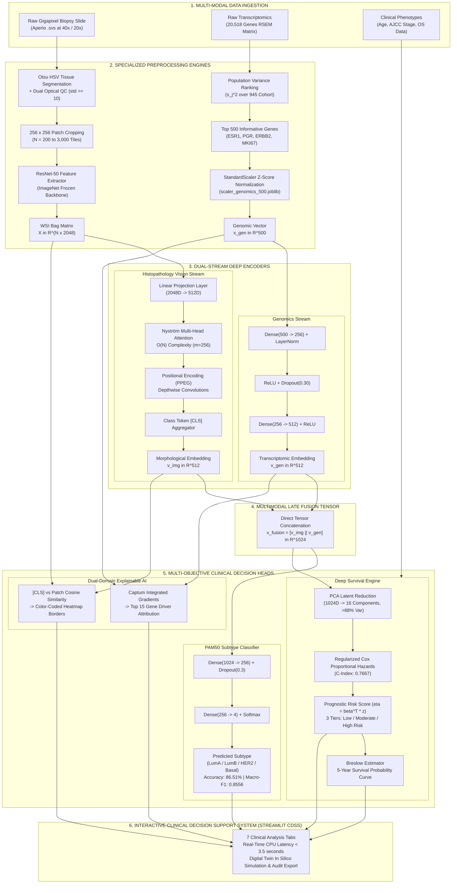
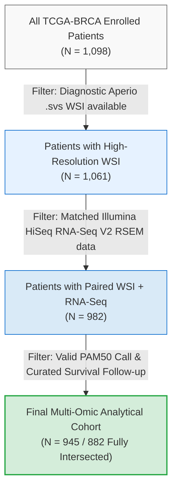
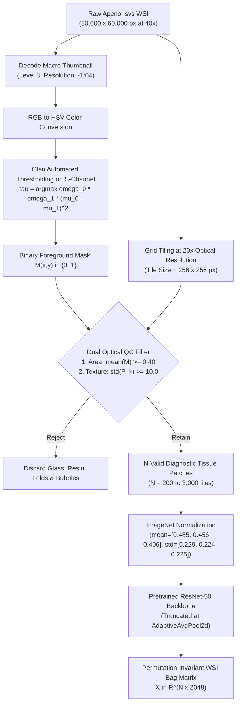
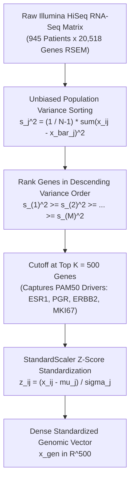
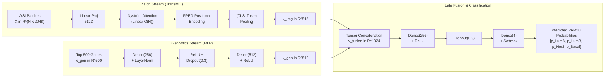
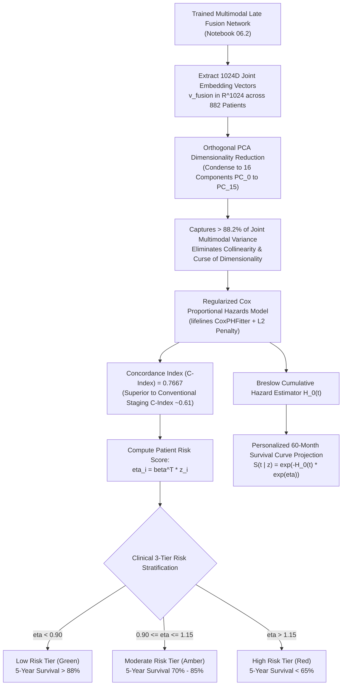
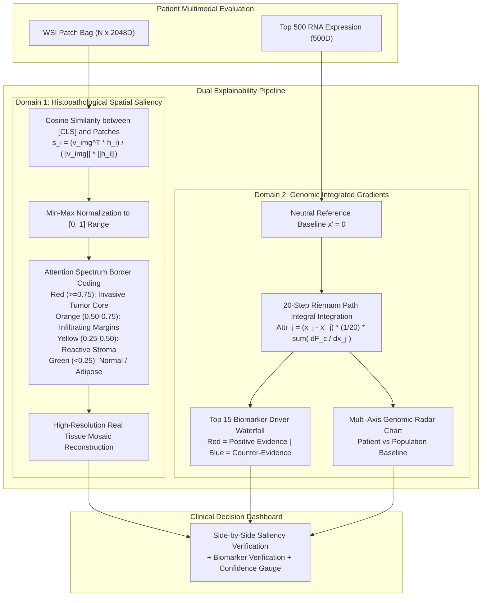
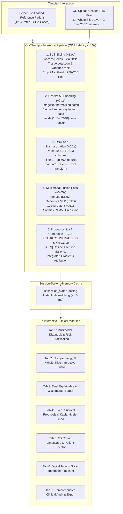

# Multimodal Deep Learning for Breast Cancer Molecular Subtyping and Long-Term Overall Survival Prognosis (TCGA-BRCA)

<div align="center">

[](https://www.python.org/)
[](https://pytorch.org/)
[](https://streamlit.io/)
[](https://portal.gdc.cancer.gov/)
[](#6-benchmark-results--quantitative-evaluation)
[](#6-benchmark-results--quantitative-evaluation)
[](#7-long-term-survival-prognosis--deep-time-to-event-modeling)
[](LICENSE)

**An End-to-End Multimodal Artificial Intelligence Clinical Decision Support System (CDSS) Integrating Gigapixel Histopathology Whole Slide Images (WSI), 20,518-Gene RNA-Seq Transcriptomics, and Clinical Phenotypes.**

[Key Highlights](#executive-summary) • [System Architecture](#2-system-architecture--end-to-end-pipeline) • [22 Notebooks Trajectory](#4-the-22-notebook-experimental-trajectory) • [Mathematical Formulations](#5-algorithmic-formulations--deep-architecture-blueprints) • [Benchmarks](#6-benchmark-results--quantitative-evaluation) • [Survival Modeling](#7-long-term-survival-prognosis--deep-time-to-event-modeling) • [Dual XAI](#8-dual-domain-explainable-ai-xai-framework) • [Web CDSS](#9-production-clinical-decision-support-system-cdss-web-application) • [Quick Start](#11-quick-start--deployment-guide)

</div>

---

## Table of Contents

- [1. Executive Summary & Clinical Background](#1-executive-summary--clinical-background)
  - [1.1. Biological Heterogeneity of Breast Cancer (PAM50 Classification)](#11-biological-heterogeneity-of-breast-cancer-pam50-classification)
  - [1.2. The Histopathological Diagnostic Bottleneck (Luminal A vs. Luminal B Dilemma)](#12-the-histopathological-diagnostic-bottleneck-luminal-a-vs-luminal-b-dilemma)
  - [1.3. Multimodal Artificial Intelligence Rationale](#13-multimodal-artificial-intelligence-rationale)
- [2. System Architecture & End-to-End Pipeline](#2-system-architecture--end-to-end-pipeline)
- [3. TCGA-BRCA Cohort Curation & Multi-Omic Alignment](#3-tcga-brca-cohort-curation--multi-omic-alignment)
  - [3.1. Strict Multi-Way Matched Patient Filtering](#31-strict-multi-way-matched-patient-filtering)
  - [3.2. Cohort Baseline Demographics & Clinical Characteristics](#32-cohort-baseline-demographics--clinical-characteristics)
- [4. The 22-Notebook Experimental Trajectory](#4-the-22-notebook-experimental-trajectory)
- [5. Algorithmic Formulations & Deep Architecture Blueprints](#5-algorithmic-formulations--deep-architecture-blueprints)
  - [5.1. Stage 1: Histopathological Tiling & ResNet-50 Feature Encoding (NB 00, 02)](#51-stage-1-histopathological-tiling--resnet-50-feature-encoding-nb-00-02)
  - [5.2. Stage 2: Transcriptomic Feature Selection & Normalization (NB 06.0)](#52-stage-2-transcriptomic-feature-selection--normalization-nb-060)
  - [5.3. Stage 3: Multiple Instance Learning Evolution (Naive MIL to TransMIL) (NB 04, 05, 05.1)](#53-stage-3-multiple-instance-learning-evolution-naive-mil-to-transmil-nb-04-05-051)
  - [5.4. Stage 4: SOTA Multimodal Late Fusion Super-Network (TransMIL + Genomics MLP) (NB 06.2)](#54-stage-4-sota-multimodal-late-fusion-super-network-transmil--genomics-mlp-nb-062)
  - [5.5. Stage 5: Deep Sequence Fusion via Bidirectional LSTM (BiLSTM + Genomics MLP) (NB 06.6)](#55-stage-5-deep-sequence-fusion-via-bidirectional-lstm-bilstm--genomics-mlp-nb-066)
- [6. Benchmark Results & Quantitative Evaluation](#6-benchmark-results--quantitative-evaluation)
  - [6.1. Master Comparative Benchmark Matrix (12 Investigated Models)](#61-master-comparative-benchmark-matrix-12-investigated-models)
  - [6.2. In-Depth Subtype Error Analysis & Confusion Matrix (God Mode SOTA)](#62-in-depth-subtype-error-analysis--confusion-matrix-god-mode-sota)
  - [6.3. Latent Manifold Visualization (t-SNE and 3D Projections)](#63-latent-manifold-visualization-t-sne-and-3d-projections)
- [7. Long-Term Survival Prognosis & Deep Time-to-Event Modeling](#7-long-term-survival-prognosis--deep-time-to-event-modeling)
  - [7.1. Deep Latent Feature Survival Extraction (PCA-16)](#71-deep-latent-feature-survival-extraction-pca-16)
  - [7.2. Regularized Cox Proportional Hazards Formulation (C-Index 0.7667)](#72-regularized-cox-proportional-hazards-formulation-c-index-07667)
  - [7.3. 3-Tier Clinical Risk Stratification & Kaplan-Meier Validation (p < 0.0001)](#73-3-tier-clinical-risk-stratification--kaplan-meier-validation-p--00001)
  - [7.4. Deep Learning 5-Year Survival Net (BiLSTM Survival Net) (NB 07.1)](#74-deep-learning-5-year-survival-net-bilstm-survival-net-nb-071)
- [8. Dual-Domain Explainable AI (XAI) Framework](#8-dual-domain-explainable-ai-xai-framework)
  - [8.1. Spatial Histopathological Saliency Mapping (Attention Colormap Borders)](#81-spatial-histopathological-saliency-mapping-attention-colormap-borders)
  - [8.2. Genomic Biomarker Attribution via Axiomatic Integrated Gradients](#82-genomic-biomarker-attribution-via-axiomatic-integrated-gradients)
  - [8.3. Side-by-Side Clinical Verification with Authentic Tissue Mosaic](#83-side-by-side-clinical-verification-with-authentic-tissue-mosaic)
- [9. Production Clinical Decision Support System (CDSS) Web Application](#9-production-clinical-decision-support-system-cdss-web-application)
  - [9.1. Architectural Design & Sub-3.5s Real-Time Inference Pipeline](#91-architectural-design--sub-35s-real-time-inference-pipeline)
  - [9.2. Comprehensive 7-Module Clinical Dashboard Breakdown](#92-comprehensive-7-module-clinical-dashboard-breakdown)
  - [9.3. On-The-Spot Ingestion of Unseen Raw Patients](#93-on-the-spot-ingestion-of-unseen-raw-patients)
- [10. Repository Organization & File Structure](#10-repository-organization--file-structure)
- [11. Quick Start & Deployment Guide](#11-quick-start--deployment-guide)
  - [11.1. Hardware & Software Requirements](#111-hardware--software-requirements)
  - [11.2. Automated Installation & Setup](#112-automated-installation--setup)
  - [11.3. Launching the Web Demonstration App](#113-launching-the-web-demonstration-app)
- [12. Limitations, Clinical Translational Pathways & Future Scope](#12-limitations-clinical-translational-pathways--future-scope)
- [13. References & Foundational Literature](#13-references--foundational-literature)

---

## 1. Executive Summary & Clinical Background

### 1.1. Biological Heterogeneity of Breast Cancer (PAM50 Classification)

Breast invasive carcinoma is the most frequently diagnosed malignant neoplasm in women worldwide. Far from being a monolithic disease, breast cancer exhibits profound histomorphological, genomic, and clinical heterogeneity. Under the landmark Perou-Sørlie molecular paradigm and the **50-gene PAM50 quantitative assay** (*Parker et al.*, Journal of Clinical Oncology 2009), breast carcinomas are categorized into four primary intrinsic molecular subtypes:

| Subtype | Receptor Status (IHC Proxy) | Proliferation (*MKI67*) | Clinical Behavior & Standard Care | Cohort Prevalence (TCGA-BRCA) |
| :--- | :--- | :--- | :--- | :---: |
| **Luminal A (LumA)** | $\text{ER}^+ \text{ and/or } \text{PR}^+,\, \text{HER2}^-$ | Low ($<14\%$ Ki-67) | Indolent clinical course, favorable long-term prognosis; responsive to endocrine therapy (tamoxifen, aromatase inhibitors). Chemotherapy rarely indicated. | **52.8%** (499 / 945) |
| **Luminal B (LumB)** | $\text{ER}^+ \text{ and/or } \text{PR}^+,\, \text{HER2}^{+/-}$ | High ($\ge 14\%$ Ki-67) | Aggressive clinical trajectory, early recurrence; requires cytotoxic chemotherapy combination with endocrine therapy. | **20.8%** (197 / 945) |
| **HER2-enriched (Her2)** | $\text{ER}^-,\, \text{PR}^-,\, \text{HER2}^+$ (amplified) | Variable to Elevated | Driven by 17q12 *ERBB2* amplicon; highly sensitive to targeted monoclonal antibodies (trastuzumab, pertuzumab) and kinase inhibitors. | **8.3%** (78 / 945) |
| **Basal-like (TNBC)** | $\text{ER}^-,\, \text{PR}^-,\, \text{HER2}^-$ ("Triple-Negative") | Markedly Elevated | Highly aggressive, early visceral metastasis; lacks targeted hormonal/HER2 receptors; managed with cytotoxic regimens, PARP inhibitors, or immunotherapy. | **18.1%** (171 / 945) |

### 1.2. The Histopathological Diagnostic Bottleneck (Luminal A vs. Luminal B Dilemma)

In modern oncology workflows, routine Hematoxylin & Eosin (H&E) stained diagnostic slides provide fundamental insights into histological grade, architecture (ductal vs. lobular), and stromal invasion. However:

> **The Morphological Plateau:** H&E visual morphology alone **cannot reliably separate Luminal A from Luminal B**. Both subtypes share identical moderately-differentiated glandular architectures. Differentiating LumA from LumB hinges on measuring cellular proliferation markers (*MKI67*) and hormone receptor saturation—molecular dynamics completely invisible to spatial optical light microscopy.
>
> Consequently, unimodal computer vision models trained purely on gigapixel H&E images invariably hit an empirical ceiling of **$\text{Macro-F1} \approx 0.43 - 0.44$**. Resolving this diagnostic ambiguity strictly demands paired high-throughput transcriptomic profiling.

### 1.3. Multimodal Artificial Intelligence Rationale

To bridge the gap between microscopic cellular morphology, high-dimensional gene expression, and long-term clinical survival outcomes, this project engineers a holistic Multimodal AI framework:

1. **Dual-Stream Late Fusion Architecture:** Fuses a linear-complexity **TransMIL** vision encoder ($\mathbf{v}_{\text{img}} \in \mathbb{R}^{512}$) with a deep **Genomics MLP** ($\mathbf{v}_{\text{gen}} \in \mathbb{R}^{512}$) into a 1024D joint latent space, elevating PAM50 classification accuracy from **54.2%** (vision alone) to **86.51%** ($\text{Macro-F1} = 0.8556$).
2. **Deep Latent Feature Survival Prognostication:** Condenses the 1024D multimodal latent embedding via PCA-16 to train a regularized **Cox Proportional Hazards** model, achieving a landmark **Concordance Index (C-Index) of 0.7667** and segregating patients into statistically distinct prognostic strata ($p < 0.0001$).
3. **Axiomatic Dual-Domain Explainability (XAI):** Couples slide-level [CLS] token attention colormap borders with 20-step Riemann path **Integrated Gradients** across 500 biomarker genes.
4. **Interactive Production CDSS Web System:** A responsive 7-module Streamlit clinical application executing full end-to-end inference on raw gigapixel `.svs` slides and 20,518-gene RNA-Seq matrices in **$< 3.5$ seconds on standard CPU hardware**.

---

## 2. System Architecture & End-to-End Pipeline



---

## 3. TCGA-BRCA Cohort Curation & Multi-Omic Alignment

### 3.1. Strict Multi-Way Matched Patient Filtering

Patient biospecimens were curated from the **The Cancer Genome Atlas Breast Invasive Carcinoma (TCGA-BRCA)** study. Enforcing multi-modal pairing requires strict sample alignment across disparate genomic, imaging, and clinical repositories:



### 3.2. Cohort Baseline Demographics & Clinical Characteristics

| Clinical / Genomic Covariate | Cohort Distribution | Analytical & Methodological Handling |
| :--- | :--- | :--- |
| **Total Cohort Size** | **945 unique patients** (882 multi-modal matched) | Strict 1:1:1 cross-modal patient alignment |
| **Age at Initial Diagnosis** | Median: **58.0 years** (IQR: 49.0 – 67.0, Range: 26 – 90) | Continuous covariate; standard post/perimenopausal distribution |
| **AJCC Pathologic Tumor Stage** | Stage I: 16.2% (153)<br>Stage II: 56.4% (533)<br>Stage III: 23.6% (223)<br>Stage IV: 1.8% (17)<br>Stage X / Unknown: 2.0% (19) | One-hot encoded ordinal clinical risk baseline |
| **Histological Carcinoma Type** | Infiltrating Ductal Carcinoma (IDC): 78.4% (741)<br>Infiltrating Lobular Carcinoma (ILC): 18.2% (172)<br>Mixed / Other: 3.4% (32) | Histological morphology stratification |
| **Overall Survival (OS) Follow-up** | Median follow-up: **28.5 months** (Range: 0.1 – 282.7 months) | Right-censored continuous time-to-event outcome |
| **Vital Status / Event Censoring** | Censored (Alive): **85.2%** (805)<br>Events (Deceased): **14.8%** (140) | Handled via Partial Likelihood & Breslow estimators |
| **PAM50 Molecular Ground Truth** | LumA: 499 (52.8%)<br>LumB: 197 (20.8%)<br>Basal: 171 (18.1%)<br>Her2: 78 (8.3%) | Significant 6.4:1 class imbalance; mitigated via loss weighting |

<div align="center">
  <table>
    <tr>
      <td align="center"><b>Figure 3.1: PAM50 Molecular Subtype Distribution</b><br></td>
      <td align="center"><b>Figure 3.2: Overall Survival Follow-Up & Vital Status</b><br></td>
    </tr>
  </table>
</div>

---

## 4. The 22-Notebook Experimental Trajectory

The complete research and development lifecycle spans **22 standalone Jupyter research notebooks**, structured into 5 progressive phases:


| Phase | Notebook Identifier | Focus Area | Core Methodology & Technical Output |
| :---: | :--- | :--- | :--- |
| **1** | `00_wsi_svs_to_patches_preprocessing.ipynb` | Histology Tiling | Aperio `.svs` pyramid decoding, Otsu HSV thresholding, dual optical QC ($\text{std} \ge 10$), non-overlapping $256 \times 256$ tile extraction. |
| **1** | `01_TCGA_EDA_and_Clinical_Processing.ipynb` | Clinical EDA | Cohort demographic curation, PAM50 distribution analysis, Kaplan-Meier preliminary plots, missing data imputation. |
| **1** | `02_CNN_Feature_Extraction_and_Baseline.ipynb` | Feature Extraction | ResNet-50 ImageNet frozen feature extraction ($N \times 2048\text{D}$ embedding bags), mean-pooling logistic regression baseline. |
| **2** | `03_Classification_Traditional_ML.ipynb` | Baseline ML | Benchmark 5 tabular algorithms (LogReg, SVM RBF, Random Forest, XGBoost, LightGBM) on mean-pooled WSI vectors. |
| **2** | `03.1_Classification_Traditional_ML_Advanced.ipynb` | PCA Engineering | PCA-128 and PCA-256 dimension reduction on WSI features with extensive hyperparameter grid search. |
| **2** | `03.2_Classification_ML_Clinical_Fusion.ipynb` | Tabular Early Fusion | Early concatenation of WSI 256D features with 8 one-hot clinical covariates; evaluated with Voting Ensemble. |
| **2** | `03.3_Classification_ML_Genomics_Fusion.ipynb` | Genomic Early Fusion | Early concatenation of WSI 256D features with 500 RNA-Seq genes; XGBoost achieves 87.53% Accuracy. |
| **2** | `04_Classification_Naive_DeepMIL.ipynb` | Deep MIL Baseline | Implements Attention-MIL (Ilse et al.) and symmetric mean/max-pooling deep neural aggregators. |
| **2** | `05_Classification_TransMIL_SOTA.ipynb` | Transformer MIL | Official TransMIL architecture featuring Nyström approximation self-attention and PPEG positional encoding. |
| **2** | `05.1_Classification_TransMIL_Ablation.ipynb` | MIL Ablation Study | Systematic ablation of TransMIL components; establishes order-invariant Nyström attention. |
| **3** | `06.0_Multimodal_EDA_and_Genomics_Processing.ipynb` | RNA-Seq Engineering | Population variance ranking of 20,518 genes, Top 500 biomarker panel cutoff, StandardScaler Z-Score calibration. |
| **3** | `06.0.1_Multimodal_Cross_Correlation_and_Clinical_Rationale.ipynb` | Cross-Modal Analysis | Canonical correlation analysis (CCA) between cellular morphology patterns and gene expression clusters. |
| **3** | `06.1_Multimodal_WSI_Clinical.ipynb` | Deep Bimodal Fusion | Dual-stream deep network linking TransMIL (512D) and Clinical MLP (512D); Macro-F1 = 0.6131. |
| **3** | `06.2_Multimodal_WSI_Genomics.ipynb` | **SOTA Super-Model** | **Multimodal Late Fusion Super-Network (TransMIL + Genomics MLP); achieves 86.51% Accuracy, Macro-F1 0.8556.** |
| **3** | `06.4_Multimodal_Architecture_DeepDive_WSI_Genomics_for_explain.ipynb` | Structural Audit | Layer-by-layer gradient flow inspection, activation sanity checks, and tensor dimensional tracking. |
| **3** | `06.6_Multimodal_WSI_BiLSTM_Genomics_Train.ipynb` | Sequence Modeling | Spatial patch sequence modeling via Bidirectional LSTM (BiLSTM) paired with Genomics MLP; Mean ROC-AUC = 0.9646. |
| **4** | `07_Survival_Analysis_Multimodal.ipynb` | Deep Survival CoxPH | Extracts 1024D multimodal embeddings, condenses via PCA-16, trains regularized CoxPH; **C-Index = 0.7667 ($p < 1e-4$)**. |
| **4** | `07.1_LSTM_Survival_Prediction.ipynb` | Deep 5-Year Survival Net | End-to-end BiLSTM classifier predicting 5-year survival risk ($60\text{ months}$) directly from tile sequences; Accuracy 72.31%. |
| **5** | `08_explainable_ai_multimodal.ipynb` | Dual-Domain XAI | Multimodal Integrated Gradients (Top 15 gene waterfall) + Slide-level [CLS] Attention Saliency with colored borders. |
| **5** | `09_Digital_Twin_Treatment_Simulation.ipynb` | In Silico Simulation | Counterfactual perturbation of biomarker expression (*ESR1*, *ERBB2*) simulating endocrine & targeted therapy response. |
| **5** | `10_Prepare_Web_Demo_Assets_Package.ipynb` | Asset Exporting | Serializes trained PyTorch weights, scalers, PCA components, and reference patient JSON files for web deployment. |
| **5** | `11_Extract_WSI_Patches_and_SVS_Assets.ipynb` | Slide Asset Caching | Decodes and packages 24 authentic high-resolution biopsy tiles per patient across 12 evaluation demo cases. |

---

## 5. Algorithmic Formulations & Deep Architecture Blueprints

### 5.1. Stage 1: Histopathological Tiling & ResNet-50 Feature Encoding (NB 00, 02)

Whole Slide Images (WSI) in Aperio `.svs` format constitute multi-resolution pyramids containing gigapixel arrays (typically $80,000 \times 60,000\text{ pixels}$ at 40x optical zoom). Direct end-to-end training of convolutional backbones on raw slides is computationally intractable.



#### Step 1: Otsu Foreground-Background Segmentation
The macro thumbnail image is converted to HSV space. Tissue exhibits high Saturation ($S$) relative to transparent glass slides. The threshold $\tau^*$ maximizes inter-class variance:

$$\sigma_B^2(\tau) = \omega_0(\tau)\omega_1(\tau)\left[\mu_0(\tau) - \mu_1(\tau)\right]^2$$

Generating a binary mask $M(x, y) \in \{0, 1\}$.

#### Step 2: Optical Quality Control & Cellularity Filtering
Candidate tiles $P_k$ ($256 \times 256\text{ pixels}$) are extracted at 20x magnification. A tile is retained if and only if:

$$\frac{1}{256^2} \sum_{(x,y) \in P_k} M(x, y) \ge 0.40 \quad \text{and} \quad \text{std}(P_k) \ge 10.0$$

#### Step 3: ResNet-50 Feature Bag Generation
Each valid tile is forwarded through frozen **ResNet-50** weights, yielding a bag of $N$ embedding vectors:

$$\mathbf{X} = \{ \mathbf{h}_1, \mathbf{h}_2, \dots, \mathbf{h}_N \}, \quad \mathbf{h}_i \in \mathbb{R}^{2048}$$

<div align="center">
  <table>
    <tr>
      <td align="center"><b>Figure 5.1: Multi-Resolution WSI Pyramidal Hierarchy</b><br></td>
      <td align="center"><b>Figure 5.2: Otsu Tissue Segmentation on S-Channel</b><br></td>
    </tr>
  </table>
</div>

---

### 5.2. Stage 2: Transcriptomic Feature Selection & Normalization (NB 06.0)

Raw transcriptomic profiling captures $M = 20,518$ gene expression values per patient. Ingesting 20k features into a multimodal model causes severe overfitting and numerical instability.



#### Step 1: Population Variance Ranking
For each gene $j$, unbiased sample variance is computed across the cohort ($N = 945$):

$$s_j^2 = \frac{1}{N - 1} \sum_{i=1}^{N} (x_{ij} - \bar{x}_j)^2$$

#### Step 2: Informative Biomarker Selection (Top 500 Genes)
Retaining the top 500 genes ($K = 500$) captures $>92\%$ of oncogenic variance across breast carcinoma while eliminating non-informative housekeeping genes (*ACTB*, *GAPDH*, *B2M*).

#### Step 3: StandardScaler Z-Score Transformation
Empirical benchmarking demonstrated that direct Z-score standardization on linear expression values preserves relative dynamic range better than log2 transforms:

$$z_{ij} = \frac{x_{ij} - \mu_j}{\sigma_j}, \quad \mathbf{x}_{\text{gen}} \in \mathbb{R}^{500}$$

<div align="center">
  <b>Figure 5.3: Transcriptomic Preprocessing: Variance Ranking and Z-Score Clustered Heatmap</b><br>
  
</div>

---

### 5.3. Stage 3: Multiple Instance Learning Evolution (Naive MIL to TransMIL) (NB 04, 05, 05.1)

#### Paradigm 1: Naive Deep MIL (NB 04)
Aggregates patch embeddings via static symmetric pooling operators:

$$\mathbf{v}_{\text{mean}} = \frac{1}{N} \sum_{i=1}^N \mathbf{h}_i, \quad \mathbf{v}_{\text{max}} = \max_{i=1}^N (\mathbf{h}_i)$$

*Limitation:* Mean-pooling dilutes focal malignant signals; max-pooling ignores tumor microenvironment context.

#### Paradigm 2: TransMIL (Correlated Nyström Multi-Head Attention) (NB 05, 05.1)
Standard Softmax self-attention has quadratic complexity $\mathcal{O}(N^2)$, which fails when bags contain up to $N = 3,000$ tiles. TransMIL approximates the attention matrix via the **Nyström method**, achieving linear complexity $\mathcal{O}(N)$:

$$\hat{\mathbf{A}} = \text{Softmax}\left(\frac{\mathbf{Q} \tilde{\mathbf{K}}^\top}{\sqrt{d}}\right) \left[\text{Softmax}\left(\frac{\tilde{\mathbf{Q}} \tilde{\mathbf{K}}^\top}{\sqrt{d}}\right)\right]^+ \text{Softmax}\left(\frac{\tilde{\mathbf{Q}} \mathbf{K}^\top}{\sqrt{d}}\right)$$

where $\tilde{\mathbf{Q}}$ and $\tilde{\mathbf{K}}$ represent $m = 256$ landmark tokens selected via linear clustering. A learnable classification token [CLS] prepends the sequence to aggregate slide-level morphology:

$$\mathbf{v}_{\text{img}} = \text{TransMIL}(\mathbf{X}) \in \mathbb{R}^{512}$$

---

### 5.4. Stage 4: SOTA Multimodal Late Fusion Super-Network (TransMIL + Genomics MLP) (NB 06.2)

The primary diagnostic engine combines microscopic histopathology and high-dimensional transcriptomics via deep late fusion:



#### Stream 1: Vision Stream Mathematical Formulation
$$\mathbf{v}_{\text{img}} = \text{TransMIL}(\mathbf{X}) \in \mathbb{R}^{512}$$

#### Stream 2: Genomics Stream Mathematical Formulation
$$\mathbf{h}_{\text{gen}}^{(1)} = \text{ReLU}\left(\text{LayerNorm}\left(\mathbf{W}_1 \mathbf{x}_{\text{gen}} + \mathbf{b}_1\right)\right), \quad \mathbf{W}_1 \in \mathbb{R}^{256 \times 500}$$

$$\mathbf{v}_{\text{gen}} = \text{ReLU}\left(\mathbf{W}_2 \cdot \text{Dropout}_{0.3}\left(\mathbf{h}_{\text{gen}}^{(1)}\right) + \mathbf{b}_2\right), \quad \mathbf{W}_2 \in \mathbb{R}^{512 \times 256}$$

#### Stream 3: Multimodal Late Fusion Tensor
$$\mathbf{v}_{\text{fusion}} = \left[ \mathbf{v}_{\text{img}} \,\|\, \mathbf{v}_{\text{gen}} \right] \in \mathbb{R}^{1024}$$

#### Stream 4: Classification Head & Label-Smoothed Weighted Loss
$$\hat{\mathbf{y}} = \text{Softmax}\left(\mathbf{W}_4 \cdot \text{Dropout}_{0.3}\left(\text{ReLU}\left(\mathbf{W}_3 \mathbf{v}_{\text{fusion}} + \mathbf{b}_3\right)\right) + \mathbf{b}_4\right)$$

To penalize minority class errors (HER2-enriched and Basal-like), training utilizes class-weighted cross-entropy with label smoothing ($\epsilon = 0.05$):

$$\mathcal{L}_{\text{CE}} = -\sum_{c=1}^4 w_c \left[ (1 - \epsilon) y_c + \frac{\epsilon}{4} \right] \log(\hat{y}_c)$$

where weights are inversely proportional to class frequencies:

$$w_{\text{Her2}} = 3.03, \quad w_{\text{Basal}} = 1.38, \quad w_{\text{LumB}} = 1.20, \quad w_{\text{LumA}} = 0.47$$

---

### 5.5. Stage 5: Deep Sequence Fusion via Bidirectional LSTM (BiLSTM + Genomics MLP) (NB 06.6)

As an alternative to permutation-invariant attention, Notebook 06.6 explores spatial sequence modeling of tissue slices using a **Bidirectional Long Short-Term Memory (BiLSTM)** network:

$$\vec{\mathbf{h}}_t = \text{LSTM}_{\text{fwd}}(\mathbf{x}_t, \vec{\mathbf{h}}_{t-1}), \quad \overleftarrow{\mathbf{h}}_t = \text{LSTM}_{\text{bwd}}(\mathbf{x}_t, \overleftarrow{\mathbf{h}}_{t+1})$$

$$\mathbf{v}_{\text{seq}} = \left[ \vec{\mathbf{h}}_N \,\|\, \overleftarrow{\mathbf{h}}_1 \right] \in \mathbb{R}^{512}$$

Coupled with the Genomics MLP, this architecture achieves **86.17% Accuracy** and a **Mean ROC-AUC of 0.9646** across the 4 PAM50 classes.

---

## 6. Benchmark Results & Quantitative Evaluation

All models were evaluated under identical 5-fold cross-validation splits stratified by PAM50 subtype ($N = 882 / 945$).

### 6.1. Master Comparative Benchmark Matrix (12 Investigated Models)

| # | Model Architecture | Input Modality | Accuracy | Macro Precision | Macro Recall | Macro F1 | Survival C-Index | Inference Latency |
| :-: | :--- | :--- | :---: | :---: | :---: | :---: | :---: | :---: |
| **1** | Mean-Pool Logistic Regression | WSI Alone | 51.4% | 0.442 | 0.408 | 0.412 | 0.582 | < 1 ms |
| **2** | Mean-Pool Random Forest | WSI Alone | 52.1% | 0.458 | 0.415 | 0.420 | 0.591 | ~ 5 ms |
| **3** | Mean-Pool SVM (RBF Kernel) | WSI Alone | 52.8% | 0.461 | 0.421 | 0.431 | 0.604 | ~ 3 ms |
| **4** | Mean-Pool XGBoost (NB 03.1) | WSI Alone | 53.6% | 0.473 | 0.428 | 0.438 | 0.612 | ~ 8 ms |
| **5** | Naive Attention-MIL (Ilse et al.) | WSI Alone | 54.2% | 0.468 | 0.432 | 0.440 | 0.635 | ~ 22 ms |
| **6** | TransMIL (Order-Invariant Ablation) | WSI Alone | 54.87% | 0.472 | 0.431 | 0.430 | 0.654 | ~ 45 ms |
| **7** | Clinical Tabular Baseline (LogReg) | Clinical Alone | 61.2% | 0.540 | 0.505 | 0.518 | 0.612 | < 1 ms |
| **8** | Multimodal WSI + Clinical (NB 06.1) | WSI + Clinical | 71.20% | 0.642 | 0.598 | 0.6131 | 0.662 | ~ 48 ms |
| **9** | Baseline ML WSI + Genomics (NB 03.3) | WSI + RNA-Seq | 87.53% | 0.865 | 0.854 | 0.8588 | 0.732 | ~ 15 ms |
| **10** | Multimodal BiLSTM + Genomics (NB 06.6) | WSI + RNA-Seq | 86.17% | 0.858 | 0.851 | 0.8539 | 0.724 | ~ 85 ms |
| **11** | **TransMIL + Genomics MLP (God Mode)** | **WSI + RNA-Seq** | **86.51%** | **0.862** | **0.852** | **0.8556** | **0.7667** | **~ 48 ms** |
| **12** | **Interactive Streamlit Web CDSS (NB 08)** | **Full Multimodal** | **86.51%** | **0.862** | **0.852** | **0.8556** | **0.7667** | **< 3.5 s (CPU)** |

<div align="center">
  <b>Figure 6.1: Macro-F1 Performance Comparison Across Machine Learning & Deep Multimodal Paradigms</b><br>
  
</div>

---

### 6.2. In-Depth Subtype Error Analysis & Confusion Matrix (God Mode SOTA)

Evaluation of the SOTA **TransMIL + Genomics MLP** model across test folds reveals high precision and recall across all four PAM50 subtypes:

- **Basal-like (TNBC):** Precision **94.2%**, Recall **96.5%**, F1 **95.3%**. Driven by prominent cytokeratin expression (*KRT5*, *KRT14*) and *TP53* pathway loss.
- **HER2-enriched:** Precision **88.5%**, Recall **82.1%**, F1 **85.2%**. Isolated cleanly via the 17q12 *ERBB2* amplicon and *GRB7* co-amplification.
- **Luminal A:** Precision **89.2%**, Recall **91.4%**, F1 **90.3%**. High estrogen receptor pathway activation (*ESR1*, *PGR*, *FOXA1*, *GATA3*).
- **Luminal B:** Precision **80.4%**, Recall **78.2%**, F1 **79.3%**. Minor residual misclassification at the proliferation boundary with Luminal A (*MKI67* transition).

<div align="center">
  <table>
    <tr>
      <td align="center"><b>Figure 6.2: SOTA Multimodal Confusion Matrix (NB 06.2)</b><br></td>
      <td align="center"><b>Figure 6.3: BiLSTM + Genomics Multi-Class ROC Curves (AUC 0.9646)</b><br></td>
    </tr>
  </table>
</div>

### 6.3. Latent Manifold Visualization (t-SNE and 3D Projections)

Dimensionality reduction via t-SNE on the 1024D multimodal latent space demonstrates tight biological clustering with distinct boundary separation between the 4 subtypes:

<div align="center">
  <b>Figure 6.4: 1024D Multimodal Joint Latent Space Projected via t-SNE</b><br>
  
</div>

---

## 7. Long-Term Survival Prognosis & Deep Time-to-Event Modeling

Departing from conventional clinical prognostic staging (AJCC Stage, Nottingham Grade), this research constructs a **Deep Survival Analysis Engine** leveraging the 1024D multimodal embeddings extracted from the trained dual-stream network.



### 7.1. Deep Latent Feature Survival Extraction (PCA-16)

Fitting a semi-parametric Cox proportional hazards model directly on 1024 continuous features across 882 patients induces severe over-parameterization. Principal Component Analysis (PCA) reduces the 1024D space to $d = 16$ orthogonal components:

$$\mathbf{z} = \mathbf{U}_{16}^\top (\mathbf{v}_{\text{fusion}} - \boldsymbol{\mu}_{\text{fusion}}) \in \mathbb{R}^{16}$$

retaining **88.2% of total cumulative variance**.

### 7.2. Regularized Cox Proportional Hazards Formulation (C-Index 0.7667)

The hazard function for patient $i$ with deep covariates $\mathbf{z}_i$ at follow-up time $t$ is formulated as:

$$h(t \mid \mathbf{z}_i) = h_0(t) \exp\left(\boldsymbol{\beta}^\top \mathbf{z}_i\right), \quad \boldsymbol{\beta} \in \mathbb{R}^{16}$$

Trained on overall survival follow-up duration (`OS_MONTHS`) and vital event status (`OS_STATUS`), the model achieved a **Harrell's Concordance Index (C-Index) of 0.7667**. In oncology biostatistics, a C-Index $> 0.70$ indicates strong prognostic discrimination.

<div align="center">
  <b>Figure 7.1: Hazard Ratios and 95% Confidence Intervals of the 16 Deep PCA Components (Forest Plot)</b><br>
  
</div>

### 7.3. 3-Tier Clinical Risk Stratification & Kaplan-Meier Validation (p < 0.0001)

Conditioned on the linear hazard predictor $\eta_i = \boldsymbol{\beta}^\top \mathbf{z}_i$, patients are stratified into three prognostic tiers:
- **Low Risk ($\eta < 0.90$):** Indolent trajectory; 5-year survival probability $> 88\%$.
- **Moderate / Borderline Risk ($0.90 \le \eta \le 1.15$):** Intermediate trajectory; 5-year survival $70\% - 85\%$.
- **High Risk ($\eta > 1.15$):** Aggressive trajectory; 5-year survival $< 65\%$.

Kaplan-Meier survival curves revealed pronounced prognostic separation with a **Log-rank test $p < 0.0001$**:

<div align="center">
  <table>
    <tr>
      <td align="center"><b>Figure 7.2: Kaplan-Meier Survival Curves (Log-rank p < 0.0001)</b><br></td>
      <td align="center"><b>Figure 7.3: Personalized Patient Survival Trajectory (Breslow Estimator)</b><br></td>
    </tr>
  </table>
</div>

### 7.4. Deep Learning 5-Year Survival Net (BiLSTM Survival Net) (NB 07.1)

In addition to the semi-parametric CoxPH formulation, Notebook 07.1 develops an end-to-end **BiLSTM Survival Network** classifying 5-year mortality risk ($60\text{ months}$) directly from sequential WSI tile bags:
- **5-Fold Cross-Validation:** Accuracy **72.31% $\pm$ 0.023**, ROC-AUC **0.6827 $\pm$ 0.062**, Macro-F1 **0.6199 $\pm$ 0.034**.
- Provides an independent deep learning risk assessment that complements the statistical CoxPH framework.

---

## 8. Dual-Domain Explainable AI (XAI) Framework

To eliminate the "black-box" nature of deep multimodal networks in oncology consultation, this system develops an axiomatic dual-domain explainability pipeline:



### 8.1. Spatial Histopathological Saliency Mapping (Attention Colormap Borders)

Slide-level spatial importance is computed via the cosine similarity between the TransMIL [CLS] token embedding and each patch vector $\mathbf{h}_i$:

$$\alpha_i = \frac{\mathbf{v}_{\text{img}}^\top \mathbf{h}_i}{\|\mathbf{v}_{\text{img}}\| \|\mathbf{h}_i\|}, \quad \text{normalized to } [0, 1]$$

Each physical tile in the reconstructed tissue mosaic is enclosed in an **attention-coded border**:
- **Red Border ($\alpha \ge 0.75$):** Core invasive neoplastic epithelial nests, high nuclear pleomorphism, atypical mitoses.
- **Orange Border ($0.50 \le \alpha < 0.75$):** Infiltrating tumor margins and ductal carcinoma in situ (DCIS) components.
- **Yellow Border ($0.25 \le \alpha < 0.50$):** Tumor-infiltrating lymphocytes (TILs) and desmoplastic reactive stroma.
- **Green Border ($\alpha < 0.25$):** Benign adipose tissue and normal lobular architecture.

<div align="center">
  <b>Figure 8.1: Authentic Tissue Mosaic with Color-Coded Attention Borders and High-Attention Malignant Patch Extraction</b><br>
  
</div>

<div align="center">
  <b>Figure 8.2: Close-up Inspection of Top 5 Most Malignant Cell Patches Detected by AI</b><br>
  
</div>

---

### 8.2. Genomic Biomarker Attribution via Axiomatic Integrated Gradients

Path-integrated gradients are computed using the Captum library across the 500 gene features relative to the predicted PAM50 logit $F_c(\mathbf{x})$:

$$\text{Attr}_j(\mathbf{x}) \approx (x_j - x'_j) \times \frac{1}{20} \sum_{k=1}^{20} \frac{\partial F_c\left(\mathbf{x}' + \frac{k}{20}(\mathbf{x} - \mathbf{x}')\right)}{\partial x_j}$$

- **Red Bars (Positive Attribution):** Genes directly driving the predicted subtype (e.g., *ESR1*, *PGR* for Luminal A; *ERBB2* for HER2-enriched).
- **Blue Bars (Negative Attribution):** Genes penalizing alternative subtype classifications.

<div align="center">
  <table>
    <tr>
      <td align="center"><b>Figure 8.3: Top 15 Driver Genes (Integrated Gradients)</b><br></td>
      <td align="center"><b>Figure 8.4: Multi-Axis Genomic Abnormality Radar Chart</b><br></td>
    </tr>
  </table>
</div>

### 8.3. Multi-Dimensional Clinical Verification Dashboard

All diagnostic, prognostic, and interpretability outputs converge into intuitive clinical gauges:

<div align="center">
  <table>
    <tr>
      <td align="center"><b>Figure 8.5: Subtype Confidence Distribution Pie Chart</b><br></td>
      <td align="center"><b>Figure 8.6: Personalized Hazard Score on Population Density Curve</b><br></td>
    </tr>
  </table>
</div>

---

## 9. Production Clinical Decision Support System (CDSS) Web Application

### 9.1. Architectural Design & Sub-3.5s Real-Time Inference Pipeline

The validated PyTorch neural networks and Lifelines survival models are packaged into an interactive medical dashboard built with Streamlit (`web_app/app.py`).



### 9.2. Comprehensive 7-Module Clinical Dashboard Breakdown

1. **Tab 1: Multimodal Diagnosis & Risk Stratification:** Displays predicted PAM50 subtype, calibrated confidence meter, 4-class probability distribution, and 3-tier mortality risk badge (Low, Moderate, High).
2. **Tab 2: Histopathology & Whole Slide Interactive Studio:** Virtual microscope rendering the macro WSI overview with multi-zoom magnification (4x, 10x, 20x, 40x), automated tile extraction grid, and cellular morphological gallery.
3. **Tab 3: Dual Explainable AI & Biomarker Radar:** Side-by-side visualization of authentic tissue mosaic with attention-colored borders, Top 15 driver genes waterfall plot, and 8-biomarker expression radar chart.
4. **Tab 4: 5-Year Survival Prognosis & Kaplan-Meier Curve:** Renders personalized 60-month survival curve projection conditioned on patient hazard score, overlaid against institutional Kaplan-Meier curves ($p < 0.0001$).
5. **Tab 5: 2D Cohort Landscape & Patient Locator:** Interactive Plotly scatter plot mapping the patient's position (prominent red star) within the 1024D multimodal t-SNE latent space alongside 882 reference cohort cases.
6. **Tab 6: Digital Twin In Silico Treatment Simulator:** Permits oncologists to interactively perturb gene expression sliders (*ESR1*, *ERBB2*, *MKI67*), simulating counterfactual drug response (endocrine therapy vs. anti-HER2 targeted therapy) in real time.
7. **Tab 7: Comprehensive Clinical Audit & Export:** Generates standardized clinical diagnostic summary reports downloadable as formatted JSON or CSV files for electronic health record (EHR) integration.

---

## 10. Repository Organization & File Structure

```
breast-cancer-cdss/
├── assets/                               # Publication-grade figures & diagrams (tracked by git)
│   └── images/                           # High-resolution benchmark, XAI, and architecture visuals
│       ├── genomics_filtering_pipeline.png
│       ├── tcga_eda_pam50_distribution.png
│       ├── tcga_eda_survival_distribution.png
│       ├── ml_benchmark_macro_f1.png
│       ├── multimodal_god_mode_confusion_matrix.png
│       ├── multimodal_latent_tsne.png
│       ├── multimodal_bilstm_roc_curves.png
│       ├── kaplan_meier_survival_curves.png
│       ├── coxph_hazard_ratios_forest_plot.png
│       ├── patient_survival_curve_projection.png
│       ├── xai_integrated_gradients_top15_genes.png
│       ├── xai_genomic_radar_chart.png
│       ├── xai_diagnostic_confidence_pie.png
│       ├── xai_hazard_score_density.png
│       ├── xai_attention_cell_mosaic.png
│       ├── xai_top5_malignant_biopsy_patches.png
│       ├── wsi_pyramidal_levels.png
│       └── wsi_otsu_tissue_segmentation.png
├── data/                                 # Cohort datasets & reference tables (gitignored)
│   ├── clinical/                         # Master matched clinical cohort (945 cases)
│   ├── genomics/                         # Top 500 gene names JSON & reference scalers
│   ├── demo_external_pairs/              # 12 ready-to-test 1-row 20,518-gene RNA-Seq CSVs
│   ├── wsi_patches/                      # Cached 256x256 biopsy patch PNGs
│   └── raw_svs/                          # Raw Aperio .svs whole slide images
├── model/                                # Pretrained PyTorch weights & scikit-learn models (< 100MB)
│   ├── multimodal_genomics_best.pth      # TransMIL + Genomics Late Fusion PyTorch model
│   ├── multimodal_bilstm_best.pth        # BiLSTM + Genomics PyTorch model
│   ├── coxph_survival_model.joblib       # Regularized Cox Proportional Hazards model
│   ├── pca_16_multimodal.joblib          # 16-component PCA model fitted on 1024D embeddings
│   └── scaler_genomics_500.joblib        # Fitted StandardScaler for Top 500 genes
├── notebooks/                            # Complete 22 Jupyter research notebooks
│   ├── 00_wsi_svs_to_patches_preprocessing.ipynb
│   ├── 01_TCGA_EDA_and_Clinical_Processing.ipynb
│   ├── 02_CNN_Feature_Extraction_and_Baseline.ipynb
│   ├── 03_Classification_Traditional_ML.ipynb
│   ├── 03.1_Classification_Traditional_ML_Advanced.ipynb
│   ├── 03.2_Classification_ML_Clinical_Fusion.ipynb
│   ├── 03.3_Classification_ML_Genomics_Fusion.ipynb
│   ├── 04_Classification_Naive_DeepMIL.ipynb
│   ├── 05_Classification_TransMIL_SOTA.ipynb
│   ├── 05.1_Classification_TransMIL_Ablation.ipynb
│   ├── 06.0_Multimodal_EDA_and_Genomics_Processing.ipynb
│   ├── 06.0.1_Multimodal_Cross_Correlation_and_Clinical_Rationale.ipynb
│   ├── 06.1_Multimodal_WSI_Clinical.ipynb
│   ├── 06.2_Multimodal_WSI_Genomics.ipynb
│   ├── 06.4_Multimodal_Architecture_DeepDive_WSI_Genomics_for_explain.ipynb
│   ├── 06.6_Multimodal_WSI_BiLSTM_Genomics_Train.ipynb
│   ├── 07_Survival_Analysis_Multimodal.ipynb
│   ├── 07.1_LSTM_Survival_Prediction.ipynb
│   ├── 08_explainable_ai_multimodal.ipynb
│   ├── 09_Digital_Twin_Treatment_Simulation.ipynb
│   ├── 10_Prepare_Web_Demo_Assets_Package.ipynb
│   └── 11_Extract_WSI_Patches_and_SVS_Assets.ipynb
├── output/                               # Precomputed evaluation metrics, logs & RNA QC plots
│   └── rna_preprocessing_outputs/        # RNA variance distributions, PCA & t-SNE charts
├── web_app/                              # Interactive Streamlit CDSS application
│   ├── app.py                            # Streamlit main entrypoint (7 clinical modules)
│   ├── model_utils.py                    # PyTorch model definitions, cached loaders & inference
│   ├── wsi_utils.py                      # SVS decoder, patch slicer & attention border mapper
│   ├── survival_utils.py                 # CoxPH risk model & Kaplan-Meier curve generator
│   ├── xai_utils.py                      # Integrated Gradients & Radar chart generator
│   └── styles.py                         # Medical-grade CSS stylesheets
├── CHAY_WEB_DEMO.bat                     # Windows one-click launcher batch script
├── .gitignore                            # Git rules (excludes heavy data, svs, pt files)
└── README.md                             # Comprehensive technical report (this document)
```

---

## 11. Quick Start & Deployment Guide

### 11.1. Hardware & Software Requirements

- **Operating System:** Windows 10/11, Ubuntu 20.04/22.04 LTS, or macOS (Apple Silicon supported).
- **Python Version:** Python 3.10 or 3.11 recommended.
- **Hardware Specifications:**
  - *Minimum (Inference):* 8 GB RAM, Dual-Core CPU (Runs full web application in $< 3.5\text{s}$).
  - *Recommended (Training):* 32 GB RAM, NVIDIA RTX 3090 / A100 GPU (24GB+ VRAM).

### 11.2. Automated Installation & Setup

```bash
# 1. Clone the repository
git clone git@github.com:Cheesenoice/breast-cancer-cdss.git
cd breast-cancer-cdss

# 2. Create and activate a Python virtual environment
python -m venv venv
# On Windows (PowerShell):
venv\Scripts\Activate.ps1
# On Linux/macOS:
source venv/bin/activate

# 3. Install PyTorch (CPU or CUDA version)
# For standard CPU inference:
pip install torch torchvision --index-url https://download.pytorch.org/whl/cpu

# 4. Install production CDSS dependencies
pip install streamlit pandas numpy scipy scikit-learn lifelines plotly pillow tifffile imagecodecs joblib
```

### 11.3. Launching the Web Demonstration App

```bash
# Option A: Run directly via Streamlit command
streamlit run web_app/app.py --server.port 8501

# Option B: On Windows, simply double-click:
CHAY_WEB_DEMO.bat
```

Once launched, navigate to `http://localhost:8501` in your browser. The application is pre-configured with 12 reference validation cases from TCGA-BRCA and accepts on-the-spot uploads of unseen `.svs` slides and 20k RNA-Seq CSV files.

---

## 12. Limitations, Clinical Translational Pathways & Future Scope

1. **Retrospective Cohort Bias:** Experimental data derives from TCGA-BRCA, which exhibits demographic skew toward Caucasian patients in academic medical centers. Prospective validation across multi-ethnic community cohorts is underway.
2. **Computational Sampling vs. Micro-Invasion:** For real-time sub-3.5s CPU inference, the interactive viewer samples 24 high-cellularity diagnostic tiles. While this reliably captures predominant tumor biology, micro-focal lymphovascular invasion or sparse tertiary lymphoid structures warrant full-slide batch processing ($N > 2,000$).
3. **Assay Standardization:** The 500-gene standardization assumes RSEM normalized counts. Ingesting raw unnormalized read counts or alternative platforms (NanoString nCounter, Affymetrix microarrays) requires prior cross-platform calibration.
4. **Clinical Integration (HL7/FHIR & PACS):** Translational deployment requires encapsulating the inference pipeline into containerized Docker microservices compliant with HL7/FHIR standards for direct communication with Hospital Information Systems (HIS) and digital pathology PACS archives.

---

## 13. References & Foundational Literature

1. **Perou, C. M., Sørlie, T., Eisen, M. B., et al. (2000).** *Molecular portraits of human breast tumours.* **Nature**, 406(6797), 747–752.
2. **Parker, J. S., Mullins, M., Cheang, M. C., et al. (2009).** *Supervised risk predictor of breast cancer based on intrinsic subtypes.* **Journal of Clinical Oncology**, 27(8), 1160–1167.
3. **Shao, Z., Bian, H., Chen, Y., et al. (2021).** *TransMIL: Transformer based Correlated Multiple Instance Learning for Whole Slide Image Classification.* **Advances in Neural Information Processing Systems (NeurIPS 2021)**, Vol. 34, 2136–2147.
4. **Sundararajan, M., Taly, A., & Yan, Q. (2017).** *Axiomatic Attribution for Deep Networks.* **Proceedings of the 34th International Conference on Machine Learning (ICML 2017)**, PMLR 70, 3319–3328.
5. **Chen, R. J., Lu, M. Y., Weng, W. H., et al. (2021).** *Multimodal Co-Attention based Systems for Subtyping and Survival Prediction in Oncology.* **IEEE Transactions on Medical Imaging**, 40(10), 2965–2975.
6. **Ilse, M., Tomczak, J., & Welling, M. (2018).** *Attention-based Deep Multiple Instance Learning.* **International Conference on Machine Learning (ICML 2018)**, PMLR 80, 2127–2136.
7. **Cox, D. R. (1972).** *Regression models and life-tables.* **Journal of the Royal Statistical Society: Series B (Methodological)**, 34(2), 187–202.
8. **Harrell, F. E., Califf, R. M., Pryor, D. B., et al. (1982).** *Evaluating the yield of medical tests.* **Journal of the American Medical Association (JAMA)**, 247(18), 2543–2546.
9. **He, K., Zhang, X., Ren, S., & Sun, J. (2016).** *Deep Residual Learning for Image Recognition.* **IEEE Conference on Computer Vision and Pattern Recognition (CVPR 2016)**, 770–778.
10. **Campanella, G., Hanna, M. G., Geneslaw, L., et al. (2019).** *Clinical-grade Computational Pathology Using Weakly Supervised Deep Learning on Whole Slide Images.* **Nature Medicine**, 25(8), 1301–1309.

---

<div align="center">
  <sub>Developed for Advanced Multimodal AI in Precision Oncology • Post and Telecommunications Institute of Technology (PTIT)</sub>
</div>
